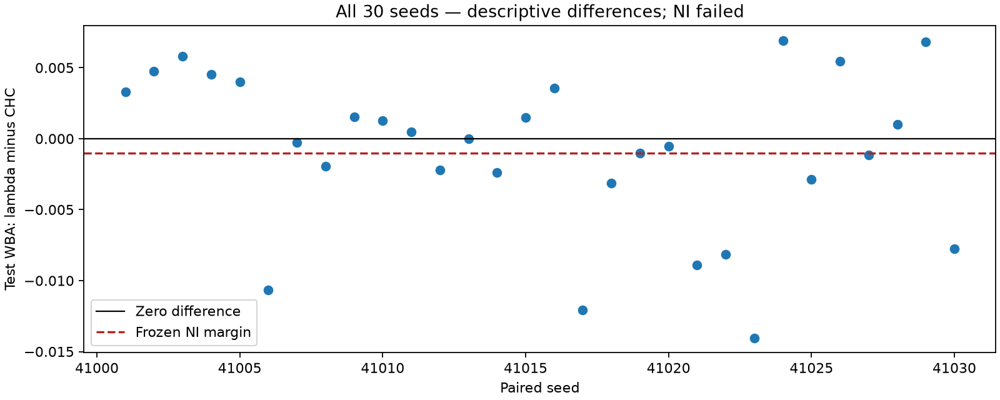
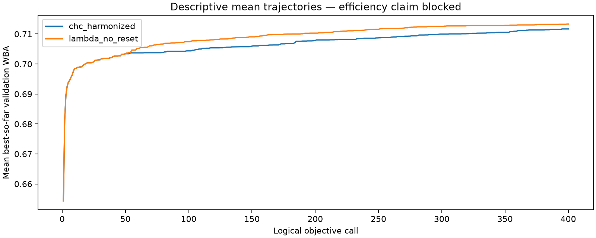

# ДОСЛІДЖЕННЯ АДАПТИВНИХ АЛГОРИТМІВ

Звіт із виробничої практики

Практична частина

Адаптивне керування мутацією та кросовером у задачі вибору ознак

2026

# АНОТАЦІЯ

У роботі досліджено адаптивне керування параметрами генетичного алгоритму в задачі вибору ознак. Розглянуто алгоритм (1+(λ,λ)), у якому параметр λ узгоджено змінює кількість нащадків, інтенсивність мутації та ймовірність успадкування змін під час кросоверу. Пояснено правила формування кандидатів, прийняття нового розв’язку та оновлення параметра за результатом покоління.

Практична частина охоплює порівняння адаптивного алгоритму з пошуком CHC за однакових умов оцінювання. Для набору Census-Income розглянуто 30 парних запусків із бюджетом 400 оцінювань для кожного алгоритму. Якість визначено за зваженою збалансованою точністю класифікації, а хід пошуку оцінено за траєкторією найкращого валідаційного результату.

Медіана парної різниці тестової якості становить мінус 0,0137 відсоткового пункту. Довірчий інтервал не дає підстав підтвердити збереження якості в межах допустимого погіршення 0,10 відсоткового пункту. Водночас зафіксовано додатну описову різницю показника прогресу пошуку. Результати показують працездатність адаптивної схеми, але не доводять її переваги за сукупністю встановлених критеріїв.

Окремо розглянуто застій пошуку, локальну оптимальність і досягнення граничного значення λ. Обґрунтовано, чому ці стани необхідно розрізняти під час оцінювання адаптивних алгоритмів.

Ключові слова: адаптивний алгоритм, генетичний алгоритм, мутація, кросовер, вибір ознак, застій пошуку, локальний оптимум.

# ВСТУП

Результативність генетичного алгоритму залежить від того, як він формує нові розв’язки та використовує інформацію про попередні спроби. Незмінна інтенсивність мутації може бути прийнятною на одному етапі пошуку й недостатньою на іншому. Адаптивний підхід передбачає зміну параметрів під час роботи алгоритму відповідно до його поточних результатів. У цій роботі розглянуто самоналаштовувану схему, яка використовує успішність покоління як зворотний зв’язок [1].

Основою практичної частини є генетичний алгоритм (1+(λ,λ)). Його особливість полягає в поєднанні двох послідовних етапів: мутації та кросоверу. Мутація формує змінені варіанти поточного розв’язку, а кросовер дозволяє використати частину змін вибраного кандидата. Кількість нащадків та властивості обох операторів пов’язані спільним параметром λ [2; 1].

Прикладною задачею обрано вибір ознак для класифікації. Алгоритм визначає, які ознаки включити до моделі, і порівнює отримані набори за якістю прогнозування. Зв’язок із методом CHC-QX полягає у використанні його предметної постановки й пошукових операторів CHC як основи для порівняння. У практичному досліді умови оцінювання обох пошукових схем узгоджено [3].

Мета роботи полягає в дослідженні поведінки адаптивного алгоритму під час вибору ознак і порівнянні його результатів із CHC за однакового бюджету. Окреме завдання становить визначення ознак застою та способу перевірки локальної оптимальності.

Об’єктом дослідження є еволюційний пошук у просторі бінарних розв’язків. Предметом є поведінка алгоритму з адаптивним керуванням мутацією та кросовером, якість обраних ним наборів ознак і перебіг пошуку.

Для досягнення мети розглянуто будову алгоритму, зіставлено її з базовою схемою CHC, визначено спільні умови порівняння та проаналізовано завершену серію парних запусків. Окрему увагу приділено програмним перевіркам правил оновлення параметрів і статистичній невизначеності висновків.

Практичне значення роботи полягає в оцінюванні конкретного способу перенесення адаптивного пошуку до задачі вибору ознак. Завершене порівняння характеризує якість і перебіг пошуку. Воно також дає підстави сформулювати наступне дослідницьке питання: чи пов’язана відсутність покращення з локальним оптимумом, особливостями керування параметрами або випадковою послідовністю невдалих кроків.

# 1 ПРИНЦИПИ РОБОТИ АДАПТИВНОГО АЛГОРИТМУ

## 1.1 Подання розв’язку та критерій вибору

Набір ознак подано послідовністю нулів і одиниць. Кожна позиція відповідає одній ознаці. Значення 1 означає її використання, а значення 0 означає виключення. Наприклад, послідовність 1 0 1 0 задає використання першої та третьої ознак. Таке подання дозволяє застосовувати мутацію й кросовер без зміни змісту задачі вибору ознак [3].

У практичному досліді порівняння кандидатів відбувається у два кроки. Спочатку визначається краща валідаційна якість класифікації. Лише за її точної рівності перевага надається меншому набору ознак. Отже, скорочення кількості ознак не компенсує погіршення основного показника.

Це правило важливе й для адаптації параметрів. Строге покращення повного критерію можливе як через підвищення якості, так і через зменшення кількості ознак за незмінної якості. Перехід до рівноцінного кандидата допускається, але не вважається успіхом для зменшення λ.

## 1.2 Мутація та кросовер

Мутація змінює вибрані біти поточного розв’язку: включена ознака може бути виключена, а виключена може бути включена. Для алгоритму (1+(λ,λ)) кількість змінених позицій випадково визначається на початку покоління. У межах цього покоління мутанти мають однакову кількість змінених бітів, але самі позиції можуть відрізнятися [2; 1].

Кросовер поєднує поточний розв’язок із вибраним мутантом. Для кожної позиції випадково визначається, з якого з двох розв’язків узяти біт. Якщо мутант містить багато змін, кросовер дозволяє перенести до нащадка лише частину з них. Тому його роль не зводиться до повторного виконання мутації [2].

У досліджуваній схемі ймовірність мутації p та ймовірність успадкування біта мутанта c визначаються так:

`p = λ / n;   c = 1 / λ.`

Тут n позначає кількість ознак, а λ читається як «лямбда». Кількість нащадків на кожному з двох етапів одержують округленням λ до найближчого цілого; значення з дробовою частиною 0,5 округлюють угору. Для практичної задачі n дорівнює 40. Наприкінці запуску кількість нащадків на обох етапах однаково скорочується, якщо залишку бюджету недостатньо для повного покоління.

Таблиця 1.1. Ілюстрація зв’язку параметрів для 40 ознак

| Значення λ | Нащадків на етап | Імовірність мутації p | Імовірність успадкування c |
| --- | --- | --- | --- |
| 1 | 1 | 0,025 | 1,00 |
| 4 | 4 | 0,100 | 0,25 |
| 10 | 10 | 0,250 | 0,10 |
| 40 | 40 | 1,000 | 0,025 |

Таблиця є поясненням формул, а не результатом окремого експерименту. Зі збільшенням λ мутація охоплює більше позицій, проте кросовер переносить меншу частку змін вибраного мутанта. Одночасно зростає кількість кандидатів, які потрібно оцінити.

## 1.3 Правило адаптації

Після завершення покоління алгоритм визначає, чи одержано строго кращий розв’язок. За успіху λ зменшується, а за відсутності успіху зростає. У досліджуваній реалізації використано коефіцієнт F = 1,5 і межі λ від 1 до 40. Зменшення та збільшення виконуються з різною швидкістю [1].

За строгого покращення застосовується правило:

`λ нового покоління = max(1; λ / F).`

За відсутності строгого покращення застосовується правило:

`λ нового покоління = min(n; λ · F^(1/4)).`

Позначення max означає вибір більшого з двох значень, а min означає вибір меншого. Множник F^(1/4) є коренем четвертого степеня з F. Таким чином, перше правило не дозволяє зменшити λ нижче одиниці, а друге не дозволяє перевищити кількість ознак.

Наприклад, за λ = 6 успішне покоління зменшує параметр до 4. За невдалого покоління λ множиться приблизно на 1,107. Це розрахункова ілюстрація правила, а не спостережена траєкторія конкретного запуску.

Адаптація впливає одразу на кілька складників пошуку. Тому λ не слід трактувати лише як імовірність мутації або лише як розмір популяції. Він узгоджує витрати на покоління та характер утворення кандидатів. У завершеному порівнянні додаткове скидання λ до одиниці вимкнено.

## 1.4 Послідовність покоління

Одне покоління складається з таких дій:

- визначення кількості нащадків і параметрів операторів за поточним λ;
- утворення та оцінювання мутантів;
- вибір одного найкращого мутанта;
- утворення нащадків кросовером цього мутанта з поточним розв’язком;
- вибір кандидата серед вибраного мутанта та нащадків кросоверу;
- прийняття кандидата, якщо він не гірший за поточний розв’язок;
- оновлення λ відповідно до наявності строгого покращення.

Фінальну маску визначають серед усіх оцінених кандидатів за тим самим критерієм. Тому результат враховує також кандидатів, оцінених до вичерпання бюджету в останньому поколінні.

# 2 БАЗА ПОРІВНЯННЯ ТА МЕТОДИКА ДОСЛІДЖЕННЯ

## 2.1 Пошукова схема CHC

Базою порівняння обрано популяційний пошук CHC, пов’язаний із методом CHC-QX для вибору ознак. Метод CHC-QX поєднує пошук із якісною апроксимацією оцінювання. У цьому досліді апроксимаційні етапи не використовуються: обидві групи отримують однакову процедуру оцінювання. Тому базовий варіант коректно називати CHC зі спільним оцінюванням, а не повним відтворенням CHC-QX [3].

У базовій схемі схрещування допускається для достатньо відмінних батьків. Відмінність визначається кількістю позицій, у яких їхні біти не збігаються. Кросовер HUX переносить приблизно половину відмінних позицій. Якщо популяція не оновлюється, поріг допустимої відмінності зменшується. Після вичерпання цього механізму виконується сильна мутація навколо найкращого розв’язку.

У використаному варіанті CHC імовірність зміни біта під час такого відновлення становить одну третину. Цю операцію не слід змішувати зі скиданням λ в адаптивному алгоритмі. Вона належить до механізму роботи базового CHC, тоді як скидання λ в досліджуваній адаптивній групі вимкнено.

Таблиця 2.1. Зіставлення пошукових схем

| Ознака порівняння | CHC зі спільним оцінюванням | Адаптивний алгоритм (1+(λ,λ)) |
| --- | --- | --- |
| Основний стан | Популяція розв’язків | Один поточний розв’язок і параметр λ |
| Кросовер | Обмін частиною відмінних бітів | Успадкування бітів вибраного мутанта з імовірністю 1/λ |
| Мутація | Сильна зміна при відновленні пошуку | Мутація в кожному поколінні з параметром λ/n |
| Керування пошуком | Зміна порога відмінності батьків | Оновлення λ за успішністю покоління |
| Спільні умови | Дані, оцінювання та бюджет | Дані, оцінювання та бюджет |

## 2.2 Дані та модель класифікації

Для практичного порівняння використано Census-Income (KDD). Набір містить відомості для класифікації рівня доходу. Офіційна навчальна частина налічує 199 523 записи, а тестова 99 762. Дані також містять вагу спостереження, яку необхідно відрізняти від ознак для прогнозування [4].

Пошук виконується в просторі 40 ознак. Ваговий стовпець виключено з маски й використано за його призначенням під час навчання та оцінювання. Від офіційної навчальної частини відокремлено 20% для валідації. Обидва алгоритми в межах однієї пари використовують той самий поділ даних і ту саму активну навчальну підвибірку з 14 964 записів.

Для оцінювання маски застосовується дерево рішень з однаковими налаштуваннями в обох групах. Алгоритми змінюють набір ознак, а не тип класифікатора. Це дозволяє порівнювати пошукові схеми без одночасної заміни моделі прогнозування.

Тестова частина не бере участі у виборі маски. Після завершення пошуку для кожної групи визначається одна фінальна маска за валідаційним критерієм. Лише тоді обчислюється її тестова якість. Так розмежовано вибір розв’язку та оцінювання його узагальнювальної здатності.

## 2.3 Показники якості та перебігу пошуку

Основний показник якості є зваженою збалансованою точністю. Для двох класів він усереднює частки правильно розпізнаних об’єктів кожного класу з урахуванням ваг спостережень. Такий підхід не зводить оцінку до частки правильних відповідей у найчисленнішому класі [5].

`Якість = (повнота першого класу + повнота другого класу) / 2.`

У цій формулі повнота кожного класу обчислюється з вагами спостережень. У таблицях показник подано в діапазоні від 0 до 1. Наприклад, 0,72 відповідає 72%. Різниця 0,001 у цій шкалі дорівнює 0,10 відсоткового пункту, а не відносному покращенню на 0,10%.

Для опису перебігу пошуку використано середнє значення найкращої досягнутої валідаційної якості за всіма 400 оцінюваннями. Воно відповідає нормованій площі під траєкторією найкращого результату. Вищий показник означає, що хороші розв’язки в середньому знаходилися раніше або мали вищу якість протягом пошуку. Далі його названо показником прогресу пошуку.

Цей показник не вимірює час у секундах. Два алгоритми можуть використати однакову кількість оцінювань, але витратити різний фізичний час. Тому висновок про швидкодію не виводиться лише з траєкторій якості.

## 2.4 Умови парного порівняння

Завершена серія містить 30 парних запусків. Кожна пара починається з однакових 50 масок, оцінювання яких входить до загального бюджету. Після ініціалізації алгоритми використовують окремі потоки випадкових чисел. Повний бюджет дорівнює 400 викликам оцінювання на алгоритм.

Повторне оцінювання вже відомої маски також витрачає один виклик. Отже, бюджет характеризує кількість звернень до процедури оцінювання, а не кількість унікальних масок або фактичних навчань класифікатора. Це правило однакове для обох груп.

Таблиця 2.2. Основні параметри практичного порівняння

| Параметр | Значення |
| --- | --- |
| Кількість парних повторів | 30 |
| Кількість ознак | 40 |
| Початкова кількість масок | 50 для обох груп |
| Бюджет на алгоритм | 400 оцінювань, включно з початковими |
| Початкове значення λ | 1 |
| Межі λ | Від 1 до 40 |
| Коефіцієнт оновлення F | 1,5 |
| Додаткове скидання λ | Вимкнено |
| Правило вибору | Вища якість; за її рівності менше ознак |

# 3 ЛОКАЛЬНІ ПЕРЕВІРКИ КОДУ ТА ПОРІВНЯННЯ РЕЗУЛЬТАТІВ

## 3.1 Робота з кодом і підготовленими результатами

ЛОКАЛЬНА МАШИНА використовується для перегляду коду, читання результатів, зіставлення параметрів і підготовки таблиць. Локальна перевірка в цьому розділі означає перевірку відповідності опису реалізованим правилам та наявним результатам. Повторний запуск алгоритмів не є частиною цієї підготовки.

Оцінювання охоплює всі 30 запланованих парних повторів. Це дозволяє врахувати мінливість результатів стохастичного пошуку.

Розрахункові приклади оновлення λ виконують іншу роль: вони пояснюють формулу та очікувану поведінку окремого кроку. Їх не змішано з експериментальними оцінками якості. Так розділено демонстрацію правила, перевірку програмної реалізації та порівняння алгоритмів.

## 3.2 Перевірка операторів і правил прийняття

Для окремого компонента покоління наявні результати 15 успішних програмних тестів. Перевірки охоплюють вибір мутанта, облік кандидатів, граничні параметри, прийняття розв’язку та відтворення результату за однакових початкових умов. Під час підготовки цієї частини використано вже отримані результати перевірок.

Таблиця 3.1. Властивості, охоплені перевірками покоління

| Властивість | Очікувана поведінка |
| --- | --- |
| Вибір мутанта | Для наступних дій зберігається той самий вибраний кандидат |
| Строге покращення | Параметр λ зменшується в установлених межах |
| Рівноцінний перехід | Не зараховується як успіх адаптації |
| Гірший кандидат | Не замінює поточний розв’язок |
| Повторні маски | Зберігаються в обліку оцінювань |
| Межі параметрів | Недопустимі значення відхиляються |
| Однакові початкові умови | Відтворюється той самий результат компонента |

Особливе значення має розмежування моменту першого оцінювання кращого кандидата та моменту його прийняття. Кращий розв’язок може бути знайдений усередині покоління, тоді як оновлення поточного стану відбувається після відбору. Для вимірювання витрат виходу із застою ці події не повинні підміняти одна одну.

## 3.3 Перевірка узгодженості порівняння

До інтерпретації таблиць необхідно встановити, що кожному повтору одного алгоритму відповідає повтор другого за однакових умов. Порівнюються поділ даних, початкові маски, критерій якості та бюджет. Результати різних умов не об’єднуються в одну оцінку ефекту.

Важливо також відрізняти медіану якості кожної групи від медіани парних різниць. Спочатку для кожної пари від якості адаптивного алгоритму віднімається якість CHC. Лише після цього визначається медіана отриманих 30 різниць. Віднімання двох окремих групових медіан загалом дає іншу величину.

# 4 РЕЗУЛЬТАТИ ПОРІВНЯННЯ ТА СТАТИСТИЧНА НЕВИЗНАЧЕНІСТЬ

## 4.1 Узагальнені результати

У таблиці 4.1 наведено медіани показників за 30 повторами для кожної пошукової схеми. Валідаційна якість характеризує результат, за яким обирається маска. Тестова якість оцінює цю маску на відкладених даних. Кількість ознак є вторинним показником.

Таблиця 4.1. Медіани показників у двох групах

| Показник | CHC зі спільним оцінюванням | Адаптивний алгоритм |
| --- | --- | --- |
| Валідаційна якість | 0,711898 | 0,713090 |
| Тестова якість | 0,721729 | 0,720729 |
| Кількість ознак | 29 | 27,5 |
| Показник прогресу пошуку | 0,705899 | 0,709385 |
| Кількість оцінювань | 400 | 400 |

Значення 27,5 для кількості ознак є медіаною вибірки з парною кількістю спостережень: воно утворюється усередненням двох центральних значень. Кожен окремий набір ознак має цілу кількість елементів.

Адаптивна група має вищу групову медіану валідаційної якості та нижчу медіану тестової якості. Така відмінність підкреслює необхідність відкладеного оцінювання. Покращення критерію, за яким виконується пошук, не гарантує кращого результату на нових даних.

## 4.2 Оцінка похибки та довірчі інтервали

Статистична невизначеність характеризує мінливість парної різниці результатів між 30 повторами. Між повторами змінювалися поділ навчальних даних, навчальна підвибірка, початкові маски та випадкова послідовність пошукових кроків. У межах кожної пари умови оцінювання були однаковими. Для побудови довірчого інтервалу використано парний бутстреп із корекцією зміщення та прискорення, BCa [6].

Процедура зберігає відповідність алгоритмів усередині кожної пари. Застосовано 50 000 повторних вибірок і двобічний довірчий інтервал із рівнем довіри 95%. Бутстреп-повтори не є новими незалежними експериментами: вони використовують ті самі 30 початкових пар.

Таблиця 4.2. Парні різниці «адаптивний алгоритм мінус CHC»

| Показник | Медіана різниці | Нижня межа 95% інтервалу | Верхня межа 95% інтервалу |
| --- | --- | --- | --- |
| Тестова якість, відсоткові пункти | -0,013734 | -0,208726 | +0,151807 |
| Прогрес пошуку, шкала від 0 до 1 | +0,001936 | +0,001235 | +0,003150 |

Інтервал для тестової якості містить як від’ємні, так і додатні значення. Отже, наявні дані допускають різні напрями ефекту. Точкова оцінка поблизу нуля сама по собі не підтверджує еквівалентності алгоритмів.

Для перевірки збереження якості наперед визначено максимально допустиме погіршення 0,10 відсоткового пункту. Нижня межа довірчого інтервалу повинна бути більшою за мінус 0,10. Фактична нижня межа дорівнює мінус 0,208726, тому збереження якості в установлених межах не підтверджено. Інтервал охоплює нуль, тому напрям відмінності тестової якості залишається невизначеним.

Інтервал для показника прогресу пошуку є додатним. Проте правило оцінювання передбачає, що висновок про перевагу пошукової ефективності робиться лише після підтвердження збереження якості. Оскільки перший критерій не виконано, додатну різницю наведено як описовий результат.

## 4.3 Графічне подання

На рисунку 4.1 показано різницю тестової якості для кожної пари. Додатне значення відповідає кращому результату адаптивного алгоритму, від’ємне значення відповідає кращому результату CHC. На осі абсцис наведено початкові значення генератора випадкових чисел, які розрізняють повтори. На осі ординат різницю подано в одиницях початкової шкали якості, а не у відсоткових пунктах.

Графік показує неоднорідність результатів: перевага не має однакового напряму в усіх повторах. Лінія допустимого погіршення є орієнтиром. Рішення про збереження якості приймається за довірчим інтервалом парної оцінки, а не за кількістю окремих точок над цією лінією.

На рисунку 4.2 наведено середні траєкторії найкращої валідаційної якості. Горизонтальна вісь відповідає кількості оцінювань, вертикальна вісь відповідає якості. Синя крива стосується базового CHC, а помаранчева стосується адаптивного алгоритму без скидання λ. Кожна крива узагальнює всі 30 повторів.

Вища крива вказує на кращу середню досягнуту якість на відповідному етапі пошуку. На цьому рисунку не наведено довірчих смуг. Тому відстань між кривими не слід інтерпретувати як окрему перевірку статистичної значущості в кожній точці.

## 4.4 Практична оцінка

За відведені 400 оцінювань обидва алгоритми сформували фінальні набори ознак. Адаптивна схема показала вищий описовий показник прогресу пошуку, однак збереження тестової якості в установлених межах не підтверджено. Результати засвідчують працездатність реалізації, але не дають підстав заявляти її перевагу над CHC.

# 5 ЗАСТІЙ ПОШУКУ ТА ЛОКАЛЬНІ ОПТИМУМИ

## 5.1 Чому адаптація не виключає застою

Збільшення λ після невдалого покоління змінює характер пошуку, але не гарантує появи кращого розв’язку. На мультимодальних задачах поліпшення може вимагати узгодженої зміни кількох позицій. Проміжні розв’язки при цьому можуть бути гіршими, тому звичайний відбір не приймає їх. Такі ситуації досліджуються, зокрема, на модельних функціях Jump [7; 8].

У дослідженні Хевії Фахардо та Зудгольта розглянуто поведінку самоналаштовуваного алгоритму при зростанні λ до верхньої межі. Показано, що обмеження та скидання параметра можуть змінювати складність пошуку на функціях Jump. Ці результати пояснюють можливий механізм проблеми, але не є безпосереднім доказом його дії в задачі вибору ознак [1].

Важливо також відрізняти адаптацію за успішністю від випадкового вибору інтенсивності мутації. У дослідженнях швидких генетичних алгоритмів використовують розподіли, які час від часу допускають великі мутації. Це інший механізм зміни масштабу пошуку, хоча він також пов’язаний із подоланням складних ділянок ландшафту [9].

## 5.2 Три стани, які потрібно розрізняти

Для оцінювання адаптивного алгоритму доцільно окремо фіксувати:

- застій: протягом наперед визначеної кількості оцінювань не поліпшується обраний критерій;
- локальний максимум: серед усіх сусідніх розв’язків за визначеним правилом сусідства немає строго кращого;
- насичення параметра: λ досягає дозволеної верхньої межі та не може далі зростати за невдач.

Ці стани можуть виникати одночасно, але жоден із них автоматично не доводить наявності іншого. Відсутність покращення може бути наслідком випадкових невдалих кроків. Насичення λ характеризує правило керування, а локальна оптимальність характеризує значення цільової функції в околі розв’язку.

Для задачі вибору ознак природним є окіл зі зміною одного біта. У просторі 40 ознак поточна маска має 40 таких сусідів. Якщо жоден із них не кращий за повним критерієм, маска є нестрогим локальним максимумом у цьому околі. Наявність рівноцінних сусідів може вказувати на плато. Строгий локальний максимум потребує, щоб усі сусіди були гіршими.

Перевірка одного біта не встановлює глобальної оптимальності. Кращий розв’язок може існувати на відстані двох або більше змін. Саме тому здатність алгоритму виконувати більші переходи становить окремий предмет дослідження.

## 5.3 Поведінка при граничному λ

За λ = n імовірність мутації дорівнює одиниці. Кожен мутант стає повним доповненням поточного бінарного розв’язку: всі нулі переходять в одиниці, а всі одиниці в нулі. На цьому етапі всі мутанти однакові, проте кожне їх оцінювання враховується в бюджеті.

При кросовері з таким мутантом кожен біт успадковується від нього з імовірністю 1/n. Оскільки його біти протилежні бітам батька, один нащадок кросоверу в середньому відрізняється від батька на одну позицію. Таким чином, максимальне λ не означає максимальну відстань фінального нащадка від поточного розв’язку [1].

Це пояснює, чому просте зростання параметра може бути недостатнім для виходу з ділянки, де потрібна одночасна зміна кількох бітів. Водночас у використаній реалізації до фінального відбору допускається і вибраний мутант. Тому не можна повністю ототожнювати її поведінку з однією стандартною мутацією: необхідно враховувати всі допустимі кандидати.

## 5.4 Як відокремити відтворення проблеми від перевірки покращення

Першим дослідницьким завданням є встановлення самого стану пошуку. Для цього необхідно узгодити критерій застою, обсяг спостереження та спосіб перевірки сусідів. Лише після фіксації такого стану можна оцінювати дію конкретного втручання, наприклад скидання λ або іншого правила його зміни.

Момент виходу також потребує однозначного означення. Якщо виходом вважається перше оцінювання кращої маски, витрати рахуються до цього оцінювання. Якщо предметом є прийняття нового поточного розв’язку, потрібно враховувати завершення відбору. Змішування цих подій дає різні оцінки для тієї самої траєкторії.

Якщо кращий розв’язок не знайдено до завершення бюджету, спостереження означає лише відсутність зафіксованого виходу в доступному проміжку. Воно не доводить неможливості виходу взагалі. Такі повтори мають залишатися в аналізі, а не вилучатися як невдалі.

# ВИСНОВКИ

У практичній частині розглянуто адаптивний алгоритм (1+(λ,λ)) для вибору ознак. Параметр λ узгоджує кількість нащадків, інтенсивність мутації та ймовірність успадкування змін при кросовері. Правило зменшення параметра після успіху й збільшення після невдачі формує зворотний зв’язок між результатом покоління та подальшим пошуком.

Порівняння виконано для двох пошукових схем за однакових даних, критерію якості та бюджету. Завершена серія з 30 пар показує працездатність адаптивного пошуку. Перевірки окремого покоління підтверджують визначені властивості операторів, відбору й обліку кандидатів.

Збереження тестової якості в межах допустимого погіршення 0,10 відсоткового пункту не підтверджено. Медіана парної різниці становить мінус 0,013734 відсоткового пункту, а 95% довірчий інтервал простягається від мінус 0,208726 до плюс 0,151807. Отримана оцінка не дає підстав ані стверджувати еквівалентність алгоритмів, ані оголошувати адаптивний варіант однозначно гіршим.

Додатна різниця показника прогресу пошуку характеризує перебіг завершеного експерименту. Вона не є доказом загальної переваги ефективності, оскільки попередня умова збереження якості не виконана. Скорочення кількості ознак також залишається вторинним описовим результатом.

Розмежовано застій, локальну оптимальність і насичення λ. З’ясовано, чому досягнення граничного значення параметра не гарантує далеких переходів після кросоверу. Це визначає зміст наступного етапу: спочатку відтворити й підтвердити стан пошуку, а потім дослідити умови виходу з нього.

# СПИСОК ВИКОРИСТАНИХ ДЖЕРЕЛ

1. Hevia Fajardo M. A., Sudholt D. Theoretical and Empirical Analysis of Parameter Control Mechanisms in the (1+(λ,λ)) Genetic Algorithm. ACM Transactions on Evolutionary Learning and Optimization. 2022. Vol. 2, no. 4. Article 13. 39 p. DOI: https://doi.org/10.1145/3564755.

2. Doerr B., Doerr C., Ebel F. Lessons From the Black-Box: Fast Crossover-Based Genetic Algorithms. Proceedings of GECCO 2013. New York: ACM, 2013. P. 781-788. URL: https://www.cmap.polytechnique.fr/~nikolaus.hansen/proceedings/2013/GECCO/proceedings/p781.pdf (дата звернення: 28.09.2026).

3. Altarabichi M. G., Nowaczyk S., Pashami S., Mashhadi P. S. Fast Genetic Algorithm for feature selection: A qualitative approximation approach. Expert Systems with Applications. 2023. Vol. 211. Article 118528. DOI: https://doi.org/10.1016/j.eswa.2022.118528.

4. UCI Machine Learning Repository. Census-Income (KDD): опис набору даних. URL: https://archive.ics.uci.edu/dataset/117/census+income+kdd (дата звернення: 28.09.2026).

5. Scikit-learn developers. balanced_accuracy_score: документація показника збалансованої точності. URL: https://scikit-learn.org/stable/modules/generated/sklearn.metrics.balanced_accuracy_score.html (дата звернення: 28.09.2026).

6. SciPy community. scipy.stats.bootstrap: документація бутстреп-оцінювання та методу BCa. URL: https://docs.scipy.org/doc/scipy/reference/generated/scipy.stats.bootstrap.html (дата звернення: 28.09.2026).

7. Antipov D., Doerr B., Karavaev V. A Rigorous Runtime Analysis of the (1+(λ,λ)) GA on Jump Functions. Algorithmica. 2022. Vol. 84. P. 1573-1602. DOI: https://doi.org/10.1007/s00453-021-00907-7.

8. Rajabi A., Witt C. Self-Adjusting Evolutionary Algorithms for Multimodal Optimization. Algorithmica. 2022. Vol. 84. P. 1694-1723. DOI: https://doi.org/10.1007/s00453-022-00933-z.

9. Doerr B., Le H. P., Makhmara R., Nguyen T. D. Fast Genetic Algorithms. Proceedings of GECCO 2017. New York: ACM, 2017. P. 777-784. Авторська версія: https://arxiv.org/abs/1703.03334 (дата звернення: 28.09.2026).

# ПІДСУМКОВІ ЗАУВАЖЕННЯ ДО ДОСЛІДЖЕННЯ

*Сильними сторонами роботи є парне порівняння за спільним оцінюванням, визначений до запусків бюджет і збереження негативного результату перевірки якості. Програмні тести підтверджують перевірені властивості реалізації, але не замінюють оцінювання її наукової результативності.*

*Внесок адаптації ще не відокремлено від інших відмінностей пошукових схем. Для цього потрібне порівняння того самого алгоритму з адаптивним і фіксованим λ. Вплив скидання параметра слід перевіряти окремо, зберігши інші умови незмінними.*

*У завершеному експерименті локальні максимуми не підтверджено. Наступний етап потребує наперед визначеного критерію застою, перевірки всіх однобітових сусідів і окремого обліку витрат на таку діагностику. Необхідно розрізняти перше оцінювання кращого кандидата та його прийняття. Запуски без виходу до завершення бюджету слід зберігати як спостереження з обмеженою тривалістю, а не вилучати з аналізу.*

*Кількість повторів наступної серії потрібно обґрунтувати необхідною точністю оцінювання та практичним змістом допустимого погіршення якості. Пороги не слід змінювати під уже отримані результати. Узагальнення висновків потребує інших наборів даних, бюджетів і класифікаторів; наявний результат стосується описаного порівняння на Census-Income.*
