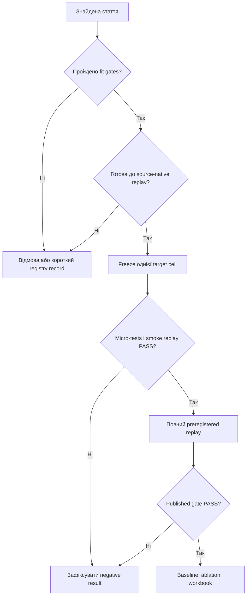

# Milestone 2026-08-07 - EU26-01 / TwoRate+HV

## 1. Рішення

EU26-01 / TwoRate+HV обрано основним частково верифікованим кандидатом
після порівняльного аудиту відкритих PR #2-#6.

Причина вибору - не абсолютна унікальність алгоритму і не повне
відтворення статті. Серед перевірених PR саме EU26-01 найкраще поєднує:

- адаптацію одного основного параметра ГА - сили мутації `r`;
- 100 бінарних decision variables;
- пряму синтетичну оптимізацію без inverse problem;
- просту математику, яку можна незалежно перевірити;
- відкритий автентифікований архів зі 100 запусками;
- точне відновлення опублікованих mean і population variance.

Правильний підсумковий статус:

`PASS_FORMULA + PASS_ARCHIVE_EXACT + BLOCKED_SOURCE_NATIVE_REPLAY`

Registry eligibility: `conditional_noneligible`.

Scope: `ARCHIVE_AND_FORMULA_VALIDATION_ONLY`.

`PASS_FULL` не досягнуто і не заявляється.

## 2. Запис milestone для проєкту

> 2026-08-07 - EU26-01 / TwoRate+HV обрано найсильнішим частково
> верифікованим кандидатом. Підтверджено 100 decision variables,
> адаптацію тільки mutation strength `r`, формули TwoRate і точний
> автентифікований 100-run archive з опублікованими mean та population
> variance. Повний source-native stochastic replay залишається
> заблокованим. Для наступних кандидатів запроваджується Protocol v2:
> відповідність основним параметрам ГА та готовність до replay повинні
> бути підтверджені до створення implementation PR.

Цей milestone фіксує завершення етапу порівняння кандидатів. Він не змінює
науковий статус статті та не перетворює часткову верифікацію на reproduction.

## 3. Що саме відповідає вимогам

| Вимога | EU26-01 |
|---|---|
| Рік | 2024 |
| Регіон | EU, Leiden University, Netherlands |
| Тип задачі | Пряма multi-objective optimization |
| Задача | Синтетична OneMinMax |
| Decision variables | 100 біт |
| Адаптація під час запуску | Так |
| Адаптивний параметр | Тільки mutation strength `r` |
| Crossover | Відсутній |
| Tournament selection | Відсутній |
| Окремий elitism rate | Не задається |
| MATLAB/Python clean-room | Реалізовано для формул і fixed transition |
| Відкриті результати | Zenodo archive, 100 runs |
| Повний source-native replay | Заблокований |

100 біт є параметрами оптимізованого розв'язку, а не 100 налаштуваннями
алгоритму. Додатковий адаптивний параметр алгоритму один - `r`.

З нього утворюються дві ймовірності мутації:

$$
p_{low}=\frac{r}{2n}, \qquad p_{high}=\frac{2r}{n}.
$$

Для frozen configuration `n=100`, `lambda=10`, `r_init=1` п'ять нащадків
використовують слабшу мутацію, а п'ять - сильнішу. Значення `r` зменшується
або збільшується вдвічі та обмежується інтервалом від `0.5` до `25`.

## 4. Що підтверджено

### 4.1 Публічний шар PR #4

Публічний [PR #4](https://github.com/ChepaMaksym/GA-article-test/pull/4)
на head `7afbabda5c55c20395c2666fa718e7397a8b1aba` підтвердив:

- Python candidate suite - `35/35 PASS`;
- registry tests - `14/14 PASS`;
- незалежний GNU Octave fixed-tape gate - `PASS`;
- exact archive identity - `PASS`;
- повноту архіву - `100/100` runs;
- mean `61623.78`, що округлюється до `61624`;
- population variance `327085104.6716`, що округлюється до `3.271e+08`.

### 4.2 Поглиблений локальний шар

Наступний локальний аудит на `228abb9ac3511602bd0866bbcf8ec940132c5991`
додав тести мутації, похибок, дисперсії, строгих входів і компактності:

- Python candidate suite - `44/44 PASS`;
- registry validation - `PASS`;
- registry fail-closed tests - `14/14 PASS`;
- exact archive - `PASS_ARCHIVE_EXACT`;
- усі 4 032 комбінації parent/nonempty mutation mask для `n=6`;
- exact zero-truncated binomial PMF, mean і variance;
- обидві межі `r`, усі update thresholds і clamp behavior;
- population та sample variance з явним `ddof`;
- invalid ZIP, JSON, protocol і numeric inputs.

Ці 44 Python-тести є локальним результатом до публікації follow-up branch.
Для кожного нового GitHub SHA Python, registry, Octave й archive jobs повинні
виконуватися знову. Зелений CI старого SHA не переноситься на новий SHA.

### 4.3 Похибка та дисперсія

| Показник | Точне значення | Значення у статті | Висновок |
|---|---:|---:|---|
| Mean | `61623.78` | `61624` | Збігається після округлення |
| Absolute mean rounding error | `0.22` | - | Не є помилкою алгоритму |
| Population variance, `ddof=0` | `327085104.6716` | `3.271e+08` | Збігається після округлення |
| Sample variance, `ddof=1` | `330388994.6177778...` | Не використовується | Дає інше `3.304e+08` |

Опубліковане число відповідає population variance з дільником `N`.
Дисперсія описує розкид function evaluations між 100 запусками, а не
похибку реалізації.

## 5. Чому попередні кандидати не стали основними

Слово "провалився" тут має різні значення. Один кандидат може відповідати
темі адаптивного ГА, але не мати достатніх доказів для відтворення. Інший
може мати зелений CI, але адаптувати не основний параметр ГА. Третій може
перевіряти лише формулу без повного алгоритму.

| PR | Кандидат | Що адаптується | Чому не став основним |
|---|---|---|---|
| [#2](https://github.com/ChepaMaksym/GA-article-test/pull/2) | USA26-01 GESMR | Один основний параметр - Gaussian mutation strength `sigma` | На рівні алгоритму підходить і має 100 decision variables. Але немає camera-ready raw runs та точного result revision. Preliminary table суперечить фінальній, є конфлікти 5/40 seeds, dimension і budget. Статус лише `FORMULA_VALIDATION_ONLY / BLOCKED_INCONCLUSIVE` |
| [#3](https://github.com/ChepaMaksym/GA-article-test/pull/3) | EU26-02 AHEAD/Deleter | Вибір і видалення пар `crossover + local search` | Не змінюється стандартний scalar GA parameter. Це складний memetic solver. Paper, code й archive конфліктують щодо 3600/10800 секунд, reward memory, update order і restart records. Статус `BLOCKED_MULTIPLE_SOURCE_CONFLICTS` |
| [#4](https://github.com/ChepaMaksym/GA-article-test/pull/4) | EU26-01 TwoRate+HV | Тільки mutation strength `r` | Обраний основним частковим кандидатом. Повний replay все ще заблокований paper/source/dependency/RNG конфліктами |
| [#5](https://github.com/ChepaMaksym/GA-article-test/pull/5) | EU26-05 adaptive crossover | Ймовірності вибору чотирьох типів crossover | Загальна crossover probability стала `p_c=1.0`; адаптується тип crossover, а не `p_c`. Немає CEC-2017 runner, author code, raw runs або seeds. Опублікований результат `27/30` не запускався |
| [#6](https://github.com/ChepaMaksym/GA-article-test/pull/6) | USA26-04 bandit mutation | У статті bandit вибирає mutation rate | Поточний PR не містить повного ГА: немає mutation transition, selection, replacement, elitism або experiment runner. Перевірено controller formulas, але Table 1 не відтворено. Статус `BLOCKED_G5_G9` |

Підсумкова класифікація:

- PR #4 - основний, найсильніший частково верифікований кандидат;
- PR #2 - резервний науково придатний mutation-only кандидат;
- PR #3 і PR #5 - не відповідають строгому визначенню основного параметра;
- PR #6 - потенційно релевантна стаття, але неповна реалізація;
- жоден із PR #2-#6 ще не має повного stochastic reproduction.

## 6. Історичний cohort та головні причини відмов

Не треба плутати історичний `EU-001` з новим `EU26-01`:

- `EU-001` - Adaptive Gene Level Mutation зі старого 15-candidate cohort;
- `EU26-01` - TwoRate+HV, предмет цього milestone.

У попередньому cohort було 15 кандидатів:

- 2 `hard_pass`, обидва виконані та numerically failed;
- 3 `conditional_noneligible`;
- 10 `hard_fail`.

Найчастіші причини відмов:

1. Немає законного або точного full text потрібної версії.
2. Фактична кількість active decision variables менша за 11.
3. Адаптується surrogate, fitness model, local search або operator name, а не
   основний параметр ГА.
4. Немає повної формули, bounds, initial value, update timing або tie rule.
5. Відсутні code revision, license, raw inputs, generator, seeds чи RNG states.
6. Paper, code й archive описують різні budgets або state transitions.
7. Немає literal numeric endpoint, який можна перевірити без вигаданого
   tolerance.
8. Для запуску потрібні складні physical, inverse, proprietary або external
   solver pipelines.

Головний урок - зелений unit-test suite не компенсує відсутність
source-to-table provenance.

## 7. Чому EU26-01 унікальний саме для цього проєкту

EU26-01 не є єдиним mutation-only алгоритмом. GESMR у PR #2 також адаптує
тільки силу мутації. Тому правильна теза про унікальність така:

> Серед перевірених PR лише EU26-01 одночасно має один основний адаптивний
> параметр ГА, 100 decision variables, просту незалежно перевірну математику
> та автентифікований архів 100 first-hit traces, з якого безпосередньо
> перераховуються mean і population variance Table 1.

Його переваги:

1. Адаптивний locus легко пояснити - змінюється тільки `r`.
2. Зв'язок із mutation probabilities є прямим і математично явним.
3. OneMinMax не потребує physical model, dataset cleaning або proprietary
   solver.
4. 100 біт безсумнівно виконують вимогу `D > 10`.
5. Архів дозволяє перевірити опубліковані числа без Monte Carlo припущень.
6. Малий scientific kernel можна незалежно реалізувати в Python та
   MATLAB/Octave.
7. Межі доказу чіткі: archive/table підтверджено, source-native trajectories
   не підтверджено.

Це унікальність evidence package для поточного набору, а не заява про
світову наукову новизну.

## 8. Що не вдалося і чому `PASS_FULL` заборонений

1. Literal one-based Algorithm 2 дає 4 low і 6 high offspring, тоді як
   prose та source використовують 5 і 5.
2. Paper не визначає tie rule для однакового максимального hypervolume.
3. IOHexperimenter revision і build не зафіксовані.
4. Clean source checkout містить absolute developer symlinks.
5. Повний environment lock відсутній.
6. Ліцензію author code не знайдено.
7. Немає ledger зі 100 seeds або RNG states.
8. Unpinned IOH sampler може повторювати індекси, хоча paper вимагає різні
   flipped bits.
9. Архів не містить усі random decisions кожної траєкторії.
10. Нові 100 stochastic runs не виконувалися.

Тому exact archive recalculation не можна називати відтворенням авторського
оптимізатора.

## 9. Protocol v2 для швидшого пошуку

### Stage 0 - Fit screen, 15-20 хвилин

Відхиляти кандидата одразу, якщо хоча б одна вимога не виконується:

- peer-reviewed publication потрібного року та регіону;
- direct optimization, не inverse problem або parameter reconstruction;
- щонайменше 11 фактичних active decision variables;
- adaptation відбувається всередині одного запуску;
- змінюється дозволений core GA parameter: population size, number of
  generations/stopping budget, mutation probability/strength, crossover
  probability, tournament size/selection pressure або elitism rate;
- адаптація не обмежується operator name, local search, surrogate або fitness
  model;
- описано повний GA loop, а не лише isolated formula.

Protocol v2 допускає одночасну адаптацію одного або кількох core GA
parameters. Жорстка вимога полягає не в кількості адаптивних параметрів, а в
тому, щоб усі вони належали до дозволеного core set і мали повністю описані
initial values, bounds, triggers та update order. Звичайний fixed generation
schedule без feedback не вважається адаптацією.

### Stage 1 - Replay-readiness screen, 1-2 години

До написання коду мають бути знайдені:

- exact full-text version і hash;
- exact author-code revision та license;
- повний experiment runner;
- legal pinned inputs або complete synthetic generator;
- initial value, bounds, update frequency, order, trigger, tie rule і boundary
  behavior;
- selection, crossover, mutation, replacement, elitism і termination
  semantics;
- literal numerical table/CSV target;
- run count, budget, seeds або достатній RNG provenance;
- raw per-run results або exact regeneration path;
- pinned dependencies/environment;
- відсутність unresolved endpoint-relevant paper/code/data conflict.

Якщо критичний artifact відсутній, кандидат отримує
`CONDITIONAL_EVIDENCE`, а implementation PR не створюється.

### Stage 2 - Freeze однієї target cell

До перегляду нового результату заморозити:

- source/data hashes;
- algorithm, problem, dimension і adaptive signal;
- published target;
- run count, seeds, budget і stopping rule;
- rounding, tolerance і variance definition з явним `ddof`;
- complete adaptive transition;
- дозволені claim labels та stop conditions.

Після перегляду outcome заборонено змінювати tolerance або interpretation.

### Stage 3 - Compact scientific kernel

Спочатку реалізувати тільки:

- objective та encoding;
- adaptive update;
- потрібні selection/mutation/crossover/replacement transitions;
- boundary та invalid-input checks;
- hand-computable examples;
- exhaustive checks на малому просторі;
- fixed random tape;
- незалежне порівняння Python і MATLAB/Octave transition.

Hardware portability, API-attestation і великі comparator layers на цьому
етапі не потрібні.

### Stage 4 - Archive recalculation

Якщо raw results доступні:

1. Автентифікувати archive і exact member.
2. Перевірити schema та complete run count.
3. Перерахувати mean, population/sample variance, success rate і rounding.
4. Порівняти тільки з frozen target.

Результат цього етапу - `PASS_ARCHIVE_EXACT`, а не reproduction.

### Stage 5 - Source-native smoke replay

До повного експерименту:

1. Зібрати exact author revision у pinned environment.
2. Запустити один frozen seed.
3. Порівняти перше покоління або intermediate checkpoint.
4. Перевірити RNG, evaluation accounting і termination.

Неможливість build або checkpoint match дає
`BLOCKED_SOURCE_NATIVE_REPLAY` і зупиняє дорогий запуск.

### Stage 6 - Full replay

Повну preregistered seed matrix запускати тільки після проходження попередніх
етапів. Qualification може повернути лише:

- `PROCEED`;
- `FAIL_DECISIVE`.

Тільки terminal stage може повернути `PASS_FULL`.

### Stage 7 - Success-only work

Hardware comparison, performance optimization, fixed-GA baseline, ablations,
sensitivity analysis, Excel workbook і graphs виконуються тільки після
`PASS_FULL`.

## 10. Єдина система статусів

Необхідно зберігати чотири незалежні поля:

| Поле | Дозволені значення |
|---|---|
| Fit | `CORE_GA_PASS`, `REJECTED_SCOPE`, `REJECTED_ADAPTIVE_LOCUS`, `REJECTED_INCOMPLETE_GA` |
| Readiness | `READY_REPLAY`, `CONDITIONAL_EVIDENCE`, `BLOCKED_SOURCE_CONFLICT` |
| Evidence | `PASS_FORMULA`, `PASS_TRANSITION`, `PASS_ARCHIVE_EXACT`, `PASS_SOURCE_NATIVE`, `PASS_FULL` |
| Outcome | `NOT_RUN`, `FAIL_DECISIVE`, `INCONCLUSIVE`, `BLOCKED_<REASON>` |

CI status зберігається окремо. Green CI означає, що тести пройшли для одного
SHA. Він не означає, що статтю відтворено.

## 11. Stop rules

1. Будь-який hard-fit failure завершує кандидата коротким registry record.
2. Немає full runner або complete adaptive state machine - немає
   implementation.
3. Endpoint-relevant paper/code/data contradiction блокує replay.
4. Максимум три diagnostic variants, кожен source-supported і frozen до
   запуску.
5. Заборонено outcome-informed fitting, invented seeds і post-hoc tolerance.
6. Одночасно реалізується тільки один кандидат.
7. Evidence старого SHA не підтверджує змінений SHA.
8. Дорогий full run зупиняється після першого failed required checkpoint.
9. Перед завершенням кандидата зберігаються compact manifest, hashes, result
   і root-cause note.

## 12. Reusable checklist

- [ ] Direct optimization і `D >= 11`.
- [ ] Адаптація змінює тільки дозволені core GA parameters.
- [ ] Complete within-run adaptive state machine.
- [ ] Complete GA loop і experiment runner.
- [ ] Exact PDF, code revision, hashes і licenses.
- [ ] Legal pinned inputs або synthetic generator.
- [ ] Literal numerical target.
- [ ] Run count, seeds/RNG, budget і stopping rule.
- [ ] Raw per-run results або exact regeneration path.
- [ ] Environment і dependencies pinned.
- [ ] Paper/code/data conflict matrix resolved.
- [ ] Одна target cell, tolerance, rounding і `ddof` frozen.
- [ ] Unit, boundary, property та exhaustive-small tests пройдено.
- [ ] Fixed-tape Python/MATLAB transition збігається.
- [ ] Archive recalculation пройдено.
- [ ] Source-native smoke replay пройдено.
- [ ] Full preregistered replay пройдено.
- [ ] Усі claims прив'язані до одного commit SHA.
- [ ] CI та scientific outcome наведені окремо.

## 13. Загальний висновок

EU26-01 є найкращим поточним кандидатом не тому, що всі етапи відтворення
пройдено, а тому, що його частково підтверджений evidence package найкраще
відповідає поставленій задачі. Він демонструє адаптацію одного основного
параметра мутації на 100-вимірній синтетичній задачі та дозволяє точно
перерахувати два опубліковані статистичні показники.

Водночас відсутність source-native trajectory provenance не дозволяє
заявляти повне reproduction. Головна зміна для майбутньої роботи - не
починати implementation після тематичного збігу статті. Спочатку треба
підтвердити строгий adaptive locus, complete GA loop, exact source-to-table
зв'язок, seeds/RNG, dependencies і runnable environment. Це відсіює слабкі
кандидати до дорогого кодування та робить негативний результат швидшим,
дешевшим і науково чесним.

Публічний technical evidence package поточного шару:
[PR #4 - EU26-01 TwoRate+HV](https://github.com/ChepaMaksym/GA-article-test/pull/4).
