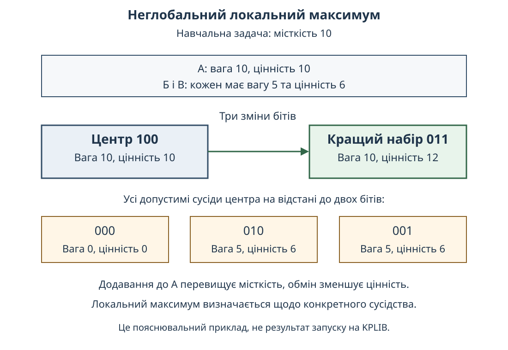
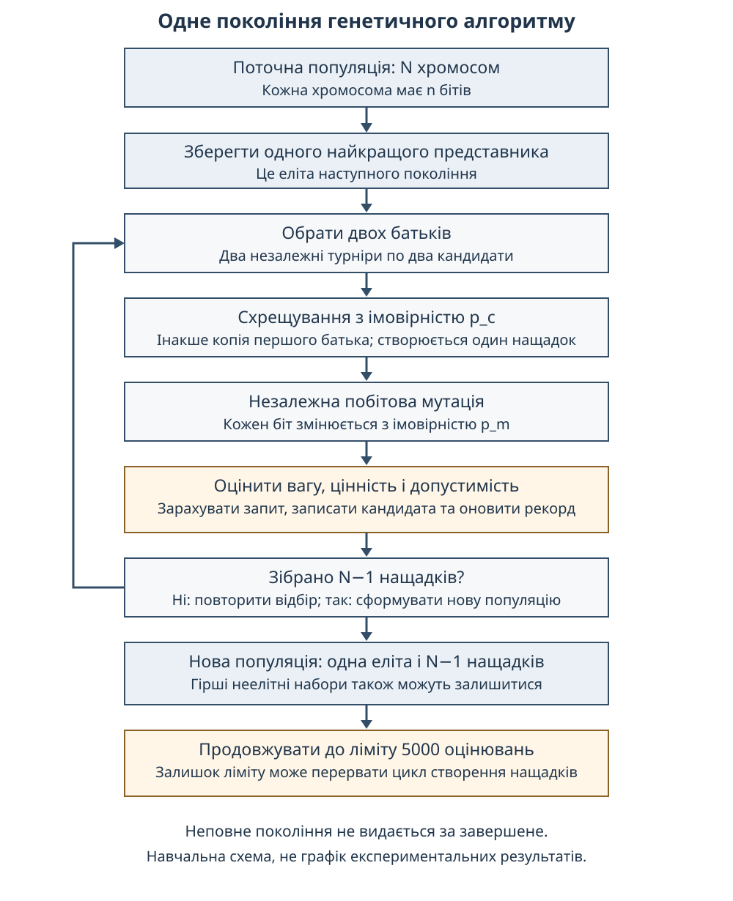

# АНОТАЦІЯ

У роботі сформульовано наукову основу дослідження параметрів генетичного алгоритму для задачі рюкзака. Потрібно обрати набір об'єктів із найбільшою сумарною цінністю, не перевищуючи встановленої місткості. Розглянуто імовірність мутації, імовірність схрещування та розмір популяції. Кожне налаштування залишається сталим протягом запуску.

Заплановано повний факторний план із 27 комбінацій та два окремі способи початку: випадкова популяція й копії одного підтвердженого неглобального локального максимуму. Локальність визначається щодо допустимих наборів, які відрізняються не більше ніж двома бітами. Точне розв'язання використовується як незалежний еталон і не передається пошуковому алгоритму.

Основою даних обрано відкриті згенеровані приклади KPLIB. Використання контрольованих задач дозволяє відокремити поведінку пошуку від похибок навчання прогнозної моделі. У документі наведено математичну постановку, правила операторів, проєкт порівняння та навчальний приклад неглобального локального максимуму. Експериментальних результатів поки немає.

Ключові слова: генетичний алгоритм, задача рюкзака, мутація, схрещування, популяція, локальний максимум, факторний план.

*Документ є науковою основою майбутнього дослідження, а не завершеним експериментальним розділом магістерської роботи. Числові приклади нижче навчальні.*

# ЗМІСТ

<!-- toc -->

# 1. ТЕМА, ПРОБЛЕМА ТА МЕТА

## 1.1 Тема й прикладний зміст

Тема магістерської роботи: «Дослідження генетичних алгоритмів». Робоче уточнення: «Вплив мутації, схрещування та розміру популяції на розв'язання задачі рюкзака й подолання локальних максимумів».

Задача рюкзака описує вибір об'єктів за обмеженого ресурсу. Наприклад, транспорт може перевезти вантаж лише до певної ваги. Кожен об'єкт має свою вагу та цінність; вибір найбільш цінного об'єкта окремо не завжди дає найцінніший допустимий набір. У цій роботі цінність є заданим числом, а не прогнозом доходу чи ймовірністю правильної відповіді. [@kellerer2004]

Генетичний алгоритм працює з багатьма наборами. Він обирає батьків, поєднує їхні рішення та випадково змінює окремі біти. Така побудова дозволяє досліджувати різні механізми пошуку, але сама по собі не гарантує знаходження глобального оптимуму. [@whitley1994]

## 1.2 Проблема дослідження

Налаштування може давати добрий кінцевий набір зі звичайного початку, але недостатньо часто знаходити кращий розв'язок після потрапляння до локального максимуму. Можлива й протилежна ситуація: сильніші зміни допомагають подолати конкретний локальний стан, проте погіршують загальний пошук через руйнування корисних комбінацій. Це припущення для перевірки, не отриманий висновок.

Потрібно розрізнити вплив мутації, схрещування й розміру популяції та їхню взаємодію. Якщо разом із ними змінювати відновлення допустимості, відбір чи ліміт оцінювань, результат не можна буде однозначно пов'язати з трьома обраними чинниками.

## 1.3 Мета, об'єкт і предмет

Мета: встановити в межах визначених еталонних задач, як три сталі параметри генетичного алгоритму впливають на кінцеву якість набору та знаходження кращого допустимого розв'язку після підтвердженого неглобального локального максимуму.

Об'єкт: стохастичний популяційний пошук у бінарній задачі оптимізації з обмеженням місткості.

Предмет: окремі ефекти та взаємодія імовірності мутації, імовірності схрещування й розміру популяції за двох визначених початкових умов.

Результатом дослідження мають бути перевірені порівняння, а не обов'язково перевага одного налаштування. Відсутність ефекту, гірший результат або залежність ефекту від класу задачі також відповідають поставленому питанню.

*На цьому етапі мету сформульовано, але емпіричних закономірностей ще не встановлено. Обсяг експерименту не є доказом наукової новизни.*

# 2. ДЖЕРЕЛА ТА МЕЖІ ЗАПЛАНОВАНОГО ВНЕСКУ

## 2.1 Що запозичено

Математична задача рюкзака, бінарне подання, базові генетичні оператори та точне динамічне програмування належать до відомих методів. Вони є інструментами цього дослідження, а не його новими результатами. [@kellerer2004;whitley1994;eiben_smith2015]

Потрібно також відрізняти налаштування від керування параметрами під час пошуку. У нашому плані значення обираються до запуску й не змінюються. Отже, робота досліджує чутливість до сталих налаштувань, а не адаптивний алгоритм. [@eiben_smit2011;eiben_smith2015;karafotias2015]

Правила пріоритету допустимості запозичено з підходу Deb: допустимий кандидат переважає недопустимого; серед допустимих порівнюють цільове значення; серед недопустимих менше порушення обмеження є кращим. Перенесення цих правил до бінарного рюкзака не означає відтворення всіх операторів авторського алгоритму. [@deb2000]

## 2.2 Найближче попереднє дослідження

Anagun і Saraç у 2006 році опублікували дослідження параметрів GA для задачі рюкзака 0–1 за методом Тагуті. У доступному описі названо розмір популяції, імовірності схрещування та мутації, класи кореляції й розміри задач. Тому сам вибір трьох чинників не є новим. [@anagun_sarac2006]

Повний текст цього найближчого попередника під час підготовки основи не отримано. За анотацією не можна підтвердити точні оператори, повторення, початкові популяції чи спосіб визначення локальності. Ці відомості не заповнюються припущеннями.

У близьких працях для одновимірного рюкзака присутні й додаткові механізми. Umbarkar і Joshi (2014) застосовують дві популяції та відновлення допустимості. Güler зі співавторами (2016) використовують структурований жадібний початок і власні оператори. У препринті Shah (2019) поєднано керовану мутацію, спеціальне схрещування й обробку порушення місткості. Їхні результати не можна переносити як чистий ефект наших трьох сталих параметрів. [@umbarkar_joshi2014;guler_etal2016;shah2019]

Окремо Pisinger (2005) аналізує складні приклади для точних розв'язувачів рюкзака. Ця складність не означає автоматично складності для нашого GA. Саме тому поведінку пошуку потрібно виміряти, а не визначати за назвою класу даних. [@pisinger2005]

| Джерело | Що перевірено | Відмінність від нашої постановки |
| --- | --- | --- |
| Anagun і Saraç, 2006 | Анотація та бібліографія | Параметри вже досліджено; точні початкові умови за закритим текстом не встановлено |
| Umbarkar і Joshi, 2014 | Доступні методи й таблиці | Дві популяції та виправлення недопустимих наборів додають інші механізми |
| Güler та співавтори, 2016 | Повний текст | Жадібний початок і специфічні оператори не збігаються з нашим GA |
| Shah, 2019 | Повний препринт | Кілька змінних механізмів, інші класи задач і зупинка за часом або поколіннями |
| Pisinger, 2005 | Анотація й доступні фрагменти | Складність оцінюється для точних розв'язувачів, не автоматично для GA |

Для базових книг та частини методологічних статей перевірено бібліографію, зміст або доступні фрагменти, а не весь текст. Загальне посилання на них не є завершеною перевіркою всіх правил майбутньої реалізації.

## 2.3 Конкретне питання цієї роботи

Запланований власний внесок: порівняти взаємодію сталих параметрів між випадковим початком і спільним сертифікованим неглобальним максимумом у допустимому двобітному околі, з однаковим лімітом оцінювань та врахуванням пов'язаності еталонних задач.

Це дослідницьке питання вужче за загальне налаштування GA. Однак інший набір параметрів або новий програмний код самі по собі не доводять пріоритету. Підставою для остаточного формулювання внеску мають бути завершений огляд найближчих праць і власні результати.

*Світовий пріоритет дизайну не встановлено. Твердження «вперше», «новий алгоритм» та «універсально найкращі налаштування» наразі не обґрунтовані.*

# 3. ДАНІ ТА ПРИЧИНИ ВИБОРУ ВИБІРКИ

## 3.1 Структура одного прикладу

Один файл задає одну задачу, а не записи про людей чи навчальну вибірку. Він містить число об'єктів n, місткість C і n пар «цінність, вага». Порядок об'єктів визначає порядок бітів хромосоми. Об'єкт i відповідає біту i; перестановку стовпців чи навчання моделі не виконують. [@kplib]

У вибраних прикладах n=100. Отже, кожна хромосома має 100 бітів. Значення 1 означає включення об'єкта, 0 означає його відсутність. Число вибраних об'єктів дорівнює сумі бітів і завжди ціле.

Набір KPLIB згенеровано за визначеними типами задач. Його не можна описувати як фактичну інформацію про склад або перевезення. Відкритий опис посилається на монографію Kellerer, Pferschy та Pisinger; ліцензія даних CC BY 4.0 вимагає зазначати походження. [@kplib;kellerer2004]

## 3.2 Три структурні класи

Заплановано по десять прикладів трьох класів: некорельованого, слабко корельованого та сильно корельованого. Класи характеризують спосіб побудови зв'язку між цінністю та вагою; не йдеться про причинність або дані про поведінку людей. Вибрано файли s000–s009 розміру 100 об'єктів із параметром генерації R01000. [@kplib]

| Відомість | Значення в проєкті |
| --- | --- |
| Число класів | 3 |
| Прикладів на клас | 10 |
| Загальна кількість задач | 30 |
| Об'єктів в одній задачі | 100 |
| Початкових значень генератора для повторень | 30 |
| Способів початку | 2, локальний лише за підтвердженого допуску |

Три класи дозволяють перевірити, чи переноситься спостережений ефект параметра між різними структурами вхідних даних. Розмір 100 обрано як обмежену постановку, для якої точний еталон попередньо посильний. Його не оголошують оптимальним розміром або достатнім представленням усіх задач рюкзака.

## 3.3 Пов'язаність прикладів

У прочитаних початкових записах слабко й сильно корельованих прикладів зі спільним індексом sNNN збігаються ваги та місткість. Повну тотожність масивів ще треба перевірити. Консервативне правило аналізу вже визначено: усі три класи з індексом sNNN утворюють одне сімейство. Отже, 30 задач не трактуються як 30 незалежних вихідних спостережень.

Повторення з різними значеннями генератора показують випадковість пошуку на тій самій задачі. Вони не створюють нових незалежних наборів даних.

*Файли ще не пройшли повного аудиту, їхні SHA256 та точні оптимуми не зафіксовано. Десять пов'язаних сімейств обмежують силу статистичних висновків; вони не є випадковою вибіркою всіх можливих задач рюкзака.*

# 4. МАТЕМАТИЧНА МОДЕЛЬ

## 4.1 Допустимість і цільове значення

Нехай x=(x₁,…,xₙ), де xᵢ належить {0,1}. Сумарну цінність позначимо V(x), сумарну вагу W(x):

$$ V(x)=Σᵢ₌₁ⁿ vᵢxᵢ;  W(x)=Σᵢ₌₁ⁿ wᵢxᵢ. $$

Допустимий набір задовольняє W(x)≤C. Потрібно знайти допустиме x із найбільшим V(x). Передбачається, що ваги та цінності є додатними цілими числами; майбутня перевірка даних має підтвердити цю умову. [@kellerer2004]

Перевищення місткості визначається як q(x)=max{0;W(x)−C}. Недопустимий набір не має «поганої точності»: він порушує ресурсне обмеження. Порожній набір допустимий і має цінність 0.

## 4.2 Простір пошуку та точний еталон

Для n об'єктів існує 2ⁿ бінарних наборів, включно з недопустимими. За n=100 це близько 1,27·10³⁰ комбінацій. Генетичний алгоритм не перебирає їх усі. Обмеження місткості відсікає частину наборів, але саме по собі не перетворює задачу на простий вибір окремих найдорожчих об'єктів.

Точний еталон передбачено отримати динамічним програмуванням. Dᵢ(c) означає найбільшу цінність, яку можна отримати з перших i об'єктів за місткості c. Якщо wᵢ≤c, порівнюють невключення об'єкта і його включення:

$$ Dᵢ(c)=max{Dᵢ₋₁(c);Dᵢ₋₁(c−wᵢ)+vᵢ}. $$

Якщо wᵢ>c, Dᵢ(c)=Dᵢ₋₁(c). Початкові значення D₀(c)=0. Підсумок V*=Dₙ(C) має супроводжуватися допустимою відновленою маскою та незалежною перевіркою її ваги й цінності. Порядок часу становить O(nC); він залежить від числової місткості, а не лише від кількості об'єктів. [@kellerer2004]

Точний розв'язувач є засобом перевірки якості. Його оптимальну маску, таблицю станів і підказки не передають до генетичного пошуку. Здатність GA знайти добрий набір на цих задачах не доводить практичної переваги над точним методом.

*Точні значення V* для KPLIB ще не обчислено. Наведена рекурентна формула описує відомий метод, а не новий теоретичний результат.*

# 5. ЛОКАЛЬНИЙ МАКСИМУМ: ОЗНАЧЕННЯ ТА ПРИКЛАД

## 5.1 Локальність залежить від сусідства

Відстань Геммінга d(x,y) дорівнює числу різних бітів. Для цієї роботи сусідство N≤2(x) складається з усіх допустимих y, для яких 1≤d(x,y)≤2.

Центр x є локальним максимумом, якщо жоден такий сусід не має більшої цінності. Якщо всі сусіди мають меншу цінність, максимум строгий; якщо є рівноцінні сусіди, це нестрогий максимум із плато. Окремо фіксують відсутність допустимих сусідів, якщо вона виникне.

Перевірка лише одного біта недостатньо змістовна для заповненого рюкзака: видалення додатно цінного об'єкта зменшує цінність, а додавання може порушувати місткість. Саме тому включено також зміни двох бітів і обмін одного об'єкта на інший.

Локальність встановлюється незалежним повним оцінюванням допустимих сусідів. Динамічне програмування окремо встановлює глобальний оптимум. Якщо V*>V(x), локальний максимум є неглобальним. Точний розв'язувач сам по собі не замінює перевірку сусідів.

## 5.2 Навчальний приклад із трьома об'єктами

Нехай місткість C=10, а об'єкти мають такі характеристики:

| Об'єкт | Вага | Цінність |
| --- | --- | --- |
| А | 10 | 10 |
| Б | 5 | 6 |
| В | 5 | 6 |

Маска 100 означає вибір А. Її вага 10, цінність 10. Додати Б або В не можна без перевищення місткості. Видалення А зменшує цінність до 0. Обмін А на Б або В дає цінність 6. Отже, серед допустимих наборів із відстанню до двох бітів кращого немає.

Маска 011 обирає Б та В: її вага 10, цінність 12. Вона краща, але відрізняється від 100 трьома бітами. Таким чином, 100 є строгим неглобальним максимумом у визначеному сусідстві, а 011 є глобальним оптимумом цього навчального прикладу.

У цьому прикладі перехід через набір із нижчою цінністю також можливий. Тому знаходження кращого розв'язку популяційним алгоритмом не обов'язково означає один прямий трьохбітний стрибок.

## 5.3 Застій не є сертифікатом

Відсутність поліпшення протягом багатьох оцінювань є спостереженням про перебіг пошуку. Вона не доводить, що перевірено всіх сусідів. Так само локальна оптимальність одного представника не означає оптимальності всієї популяції.

У спеціальній локальній серії стартова популяція міститиме копії одного сертифікованого центра. Після мутації й заміни поколінь популяція може містити інші, зокрема гірші, набори. Висновки стосуватимуться такого підготовленого початку, а не частоти природного потрапляння до максимумів.

*Приклад із трьома об'єктами побудовано для пояснення. Наявність придатних неглобальних двобітних максимумів у вибраних 30 задачах ще не підтверджено.*

# 6. СТРУКТУРА ГЕНЕТИЧНОГО АЛГОРИТМУ

## 6.1 Хромосома та популяція

Геном у цій роботі є бінарним вектором вибору об'єктів. Один ген відповідає одному об'єкту, хромосома одному набору, популяція N таким наборам. Розмір популяції та число об'єктів різні величини: популяція 30 містить 30 хромосом, кожна з яких має 100 бітів. [@whitley1994;eiben_smith2015]

Для турніру випадково вибирають двох представників із поверненням і порівнюють їх за встановленими правилами допустимості. Два батьки отримуються двома незалежними турнірами; вони можуть збігтися. Рівноцінних кандидатів обирають із однаковою імовірністю.

## 6.2 Схрещування

Із імовірністю p_c виконується рівномірне схрещування. Кожен біт одного нащадка незалежно береться від першого або другого батька з імовірністю 1/2. Якщо схрещування не виконується, копіюється перший батько. Потім у будь-якому випадку застосовується мутація. Це конкретно обраний профіль відомих операторів, не дослівне відтворення всіх варіантів GA із підручника. [@eiben_smith2015]

Навчальний приклад: батьки 1010 і 0101. Якщо біти взято за порядком «перший, другий, другий, перший», до мутації отримаємо 1100. Новий набір необхідно оцінити: поєднання двох допустимих наборів не гарантує допустимості нащадка.

Якщо обидва батьки однакові, схрещування не змінює жодного біта. Отже, у першому поколінні популяції клонів різні p_c самі по собі не створюють різноманітності. Надалі цей оператор може впливати на пошук лише за появи різних батьків.

## 6.3 Мутація та умовна математична модель

Кожен біт нащадка незалежно змінюється з імовірністю p_m. За n=100 обрані значення p_m дорівнюють 0,005; 0,01; 0,03. Очікуване число змінених бітів становить відповідно 0,5; 1; 3. Це середні величини: конкретний нащадок може мати іншу кількість змін або не змінитися зовсім. [@eiben_smith2015]

Якщо до мутації задано x, то імовірність отримати конкретну маску y на відстані d становить:

$$ Pr(x→y)=p_m^d·(1−p_m)^(n−d). $$

Формула випливає з незалежності бітів: d потрібних бітів змінюються, решта n−d не змінюються. Вона стосується одного заданого переходу після визначеного стану до мутації. Вона не передбачає частоту виходу всього GA, оскільки батьки, результати схрещування та популяція змінюються.

## 6.4 Заміна покоління й облік

Один найкращий представник зберігається без повторного оцінювання. Решта N−1 місць нового покоління заповнюються новими нащадками. Гірші неелітні набори можуть залишатися в популяції; усю нову популяцію не відбирають як N найкращих із батьків і нащадків. Це суттєво для дослідження руху через гірші проміжні набори.

Найкращий знайдений допустимий результат ведеться окремо від поточної популяції. Він не зменшується за означенням рекорду. Окремі кандидати й середня якість популяції можуть зменшуватися; їх також потрібно показувати, щоб монотонний рекорд не приховував невдалих змін.

*Детермінізм, частоти операторів і коректність лічильників ще не перевірено програмними тестами. Відомі формули не є новими законами пошуку.*

# 7. ГІПОТЕЗИ ТА ПЛАН ПОРІВНЯННЯ

## 7.1 Перевірювані припущення

Перше припущення: зміна імовірності мутації впливає на частку знаходження кращого набору після сертифікованого початку. Напрям ефекту наперед не фіксується: сильніша мутація може бути як корисною, так і шкідливою.

Друге припущення: ефект мутації залежить від схрещування й наявної різноманітності. Для однакових батьків схрещування нейтральне, але після появи різних наборів наслідок може змінитися.

Третє припущення: більша популяція не обов'язково краща за однакового ліміту оцінювань. Вона містить більше представників, але витрачає більше початкових оцінок і завершує менше поколінь за того самого ліміту.

Окреме описове питання: чи збігається розташування добрих налаштувань за кінцевим відставанням від оптимуму зі звичайного початку та за частотою поліпшення після локального початку? Різні показники не зводяться до однієї таблиці «найкращий алгоритм». Таке зіставлення не відокремлює причинного впливу локальності: між початками відрізняються також якість і різноманітність популяції.

## 7.2 Повний факторний план

| Чинник | Три рівні |
| --- | --- |
| Імовірність побітової мутації p_m | 0,5/n; 1/n; 3/n |
| Імовірність рівномірного схрещування p_c | 0; 0,5; 0,9 |
| Розмір популяції N | 10; 30; 50 |

Для кожної комбінації передбачено 30 повторень зі значеннями генератора 51001–51030. Значення однакові між конфігураціями відповідного випадку, але генератори ізольовані. Це парна організація повторень, не гарантія тотожного перебігу пошуку за різних операторів чи N.

У випадковій серії перші 10, 30 та 50 хромосом беруться зі спільного банку. Цілі популяції різних розмірів не є однаковими. Початкові оцінки банку обчислюються один раз фізично, але кожна конфігурація отримує N логічних оцінювань. Так більший розмір не отримує безкоштовного початкового перегляду додаткових наборів.

У локальній серії усі N представників мають однакову початкову маску та її відому цінність. Копії також зараховуються як N логічних оцінювань. Підготовчі витрати на центр не включаються до пошукового ліміту та показуються окремо.

## 7.3 Ліміт оцінювань

Кожна конфігурація має 5000 логічних звернень до оцінювача, включно з початковою популяцією. Кандидат із перевищенням місткості та повторна маска теж витрачають одне звернення. Після ініціалізації повторні запити не кешуються. Фізичні та логічні оцінювання показуються окремо; рівність останніх не означає рівності часу виконання.

Пошук продовжується до ліміту навіть після поліпшення або знаходження оптимуму. Якщо залишку недостатньо для цілого покоління, усі вже оцінені нащадки враховуються в рекорді, але неповне покоління не видається за завершене.

Максимально передбачено 48 600 запусків: 30 задач, 27 налаштувань, 30 повторень і два способи початку. Локальні запуски виконуються лише для допущених центрів, тому фактичне число може бути меншим. Доцільність такого обсягу ще треба перевірити інфраструктурним пілотом без підбору наукових порогів за отриманими результатами.

*Усі значення є проєктними. Повного замороженого реєстру даних, центрів і реалізації ще немає; наукової серії не запускали.*

# 8. ПОКАЗНИКИ ТА ЗАПЛАНОВАНИЙ АНАЛІЗ

## 8.1 Якість набору та поліпшення

Для випадкового початку кінцеву якість описує відносне відставання g від відомого оптимуму:

$$ g=(V*−Vbest)/V*. $$

Значення 0 означає досягнення оптимальної цінності. Більше g означає більшу невикористану можливу цінність. Цей показник не є точністю класифікації.

Для локального початку успіхом є перше оцінювання допустимого набору з V(x)>V(center). Його не обов'язково вже прийнято до наступного покоління. Для кожного запуску зберігають успіх і порядковий номер такого оцінювання. Невихід до кінця ліміту не виключають із порівняння: час спостереження обмежується значенням 5000 із позначкою невиходу.

Середнє тільки за успішними запусками може створити хибну перевагу конфігурації, яка рідко виходить, але інколи робить це швидко. Тому число оцінювань треба показувати разом із часткою невиходів.

## 8.2 Чотири наперед визначені контрасти

Первинний статистичний аналіз локальної серії порівнює: мутацію 3/n проти 1/n; схрещування 0,9 проти 0; популяцію 50 проти 10; взаємодію першого та другого порівнянь. Усереднення за рештою рівнів означає середній ефект у цій сітці, а не ефект за будь-яких можливих налаштувань.

Спочатку для кожної конфігурації обчислюють частку успіхів серед 30 повторень однієї задачі. Далі усереднюють допущені класи в межах сімейства sNNN та надають сімействам однакові ваги. Повторно вибирають цілі сімейства разом із усіма їхніми конфігураціями й повтореннями. Вибір одиниці повторної вибірки є частиною нашого дизайну; сам метод BCa відомий. Висновок залишається умовним для допущених сімейств. [@efron1987]

Передбачено 50 000 BCa-повторних вибірок зі значенням генератора 51031. Для кожного з чотирьох контрастів інтервал має номінальний рівень 98,75%; поправка Бонферроні задає номінальний сімейний рівень помилки 5%. Фактичне покриття BCa-інтервалів за малої кількості сімейств не гарантоване. Додатний інтервал вказує на більший середній показник у визначеному контрасті, від'ємний на менший; перетин нуля не підтверджує напрям ефекту.

За менш ніж п'яти допущених сімейств або виродженого інтервалу відповідні результати залишаються описовими. Випадкову серію, проміжні рівні та інші взаємодії показують описово, без додавання незареєстрованих заяв про перевагу.

## 8.3 Заплановані рисунки

Потрібні теплові карти 27 налаштувань окремо для кожного розміру популяції, криві рекорду за числом оцінювань, приклади оцінок усіх кандидатів та зміни різноманітності. Випадковий і локальний початки не об'єднують в одну середню траєкторію.

Перший за порядком допущений локальний випадок обирається для пояснення до аналізу пошукових результатів. Плоскі траєкторії й невиходи залишаються видимими. Дані коротких чи неповних запусків не продовжують штучними значеннями.

*Статистичних інтервалів і графіків експерименту ще немає. Після порівняння 27 налаштувань не можна подавати вибрану за тими самими даними «найкращу» конфігурацію як незалежно підтверджену рекомендацію.*

# 9. ПЕРЕВІРКА Й МЕЖІ ДОКАЗІВ

## 9.1 Що має бути перевірено

Точний розв'язувач перевіряється повним перебором малих задач та незалежним обчисленням ваги й цінності його маски. Окремо перевіряють повноту двобітного сусідства, нічиї, недопустимі набори й відмінність між локальним і глобальним максимумами.

Для генетичного алгоритму потрібні перевірки операторів, випадкового розв'язання нічиєї, незмінності параметрів, відтворюваності оцінки та лічильників. Важливий контрольний випадок: схрещування однакових батьків до мутації не змінює маску.

Для результатів потрібні перевірки повноти запусків, відсутності дублікатів ідентифікаторів, відповідності версій та контрольних сум. Пропущений випадок не є невдалим пошуком, а інфраструктурний збій не є негативним науковим результатом. Причини розмежовують і зберігають.

Усі програмні перевірки, підготовка даних, точне розв'язання, пошук, статистика й побудова графіків результатів виконуватимуться у віддаленому автоматизованому середовищі. Локально на цьому етапі підготовлено лише текст та навчальні схеми.

## 9.2 Чого дослідження не доводитиме автоматично

Навіть підтверджена різниця часток поліпшення не означає універсального найкращого параметра. Висновки обмежені вибраними класами задач, n=100, конкретними операторами, спеціальним локальним початком і лімітом 5000 оцінювань.

Популяція клонів дозволяє зрозуміло перевірити початковий локальний стан, але має нульову початкову різноманітність. Отримані висновки не можна без перевірки переносити на популяції з багатьма різними локальними представниками.

Дослідження сталих параметрів не є доказом користі адаптації. Наявність точного еталона на цих прикладах також не встановлює, що GA потрібний замість точного розв'язувача в реальному застосуванні.

*Окремих великих задач, інших місткостей, інших операторів та незалежної зовнішньої перевірки рекомендацій у цьому проєкті не передбачено. Їх не слід описувати як уже охоплені.*

# 10. ПІДСУМОК ПЕРШОГО ЕТАПУ

Підготовлено постановку нового дослідження, визначено прикладну задачу, джерело даних, оператори, 27 сталих налаштувань, два способи початку та правила майбутніх порівнянь. Розмежовано локальність, застій і глобальну оптимальність. Навчальний приклад показує, чому підтверджений двобітний максимум може мати кращий набір на більшій відстані.

Три параметри GA для задачі рюкзака вже вивчалися. Запланований внесок полягає в конкретному дослідженні зміни їхніх ефектів між визначеними початковими умовами з незалежними сертифікатами та контрольованим обліком. Його фактичний зміст і межі з'являться лише після результатів.

*Ще потрібно завершити аудит найближчих закритих джерел, зафіксувати хеші даних, реалізувати й перевірити алгоритми, отримати точні еталони та реєстр центрів, провести серію й аналіз. Наукового пріоритету та експериментальної переваги наразі не встановлено.*

# СПИСОК ВИКОРИСТАНИХ ДЖЕРЕЛ

<!-- references -->
