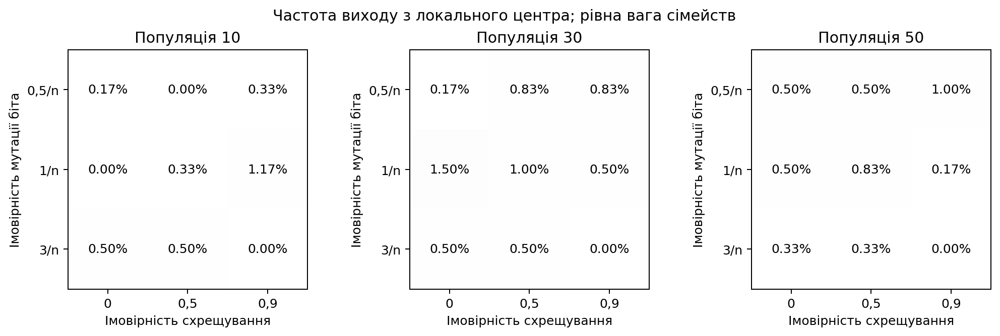
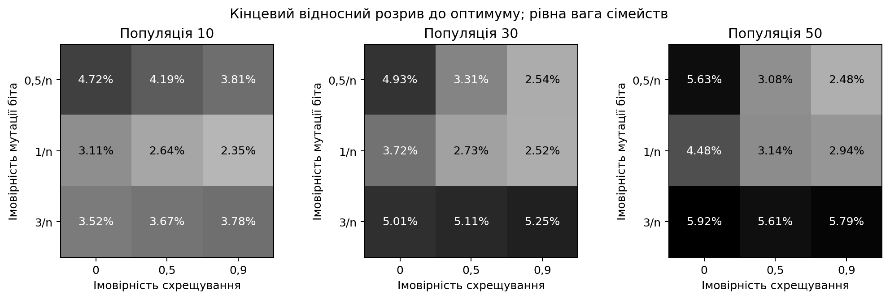
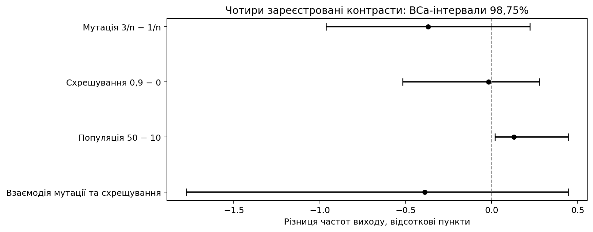
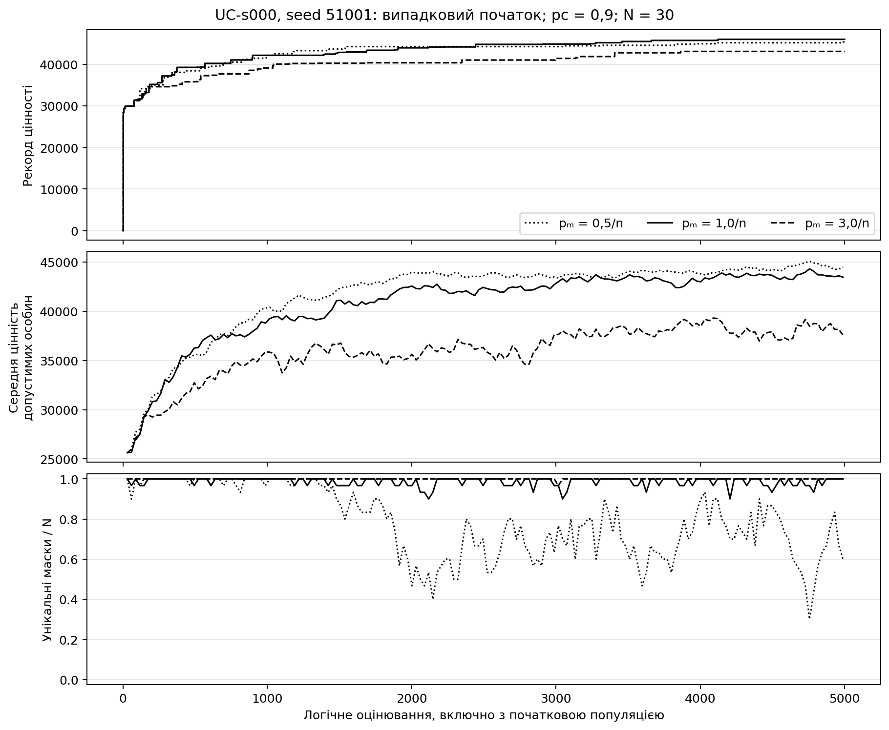
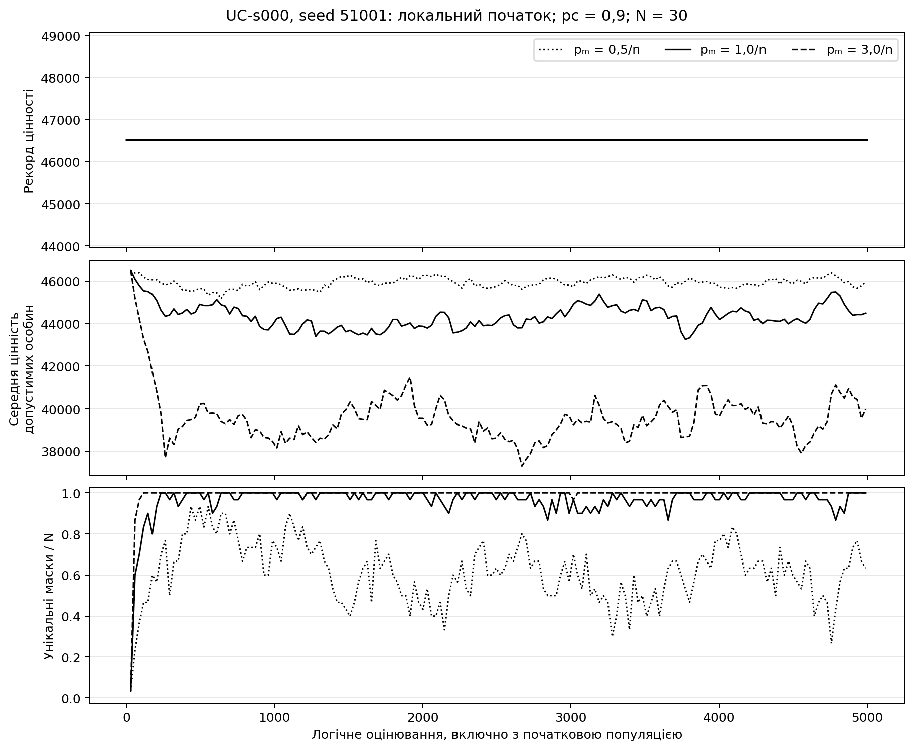

# Результати дослідження параметрів генетичного алгоритму

## 1. Постановка й дані

Досліджено один поколіннєвий бінарний генетичний алгоритм зі сталими параметрами. Теоретичною основою є огляд Whitley; пріоритет допустимості відповідає принципу порівняння за обмеженнями Deb [@whitley1994; @deb2000]. Це не новий алгоритм і не буквальне числове відтворення авторської реалізації.

Використано 30 згенерованих задач KPLIB зі 100 предметами. До локальної серії допущено 14 неглобальних центрів у 10 сімействах: 13 строгих максимумів та одне плато. Ще 16 центрів є глобальними й залишаються в реєстрі без заміни [@kplib; @kellerer2004].

Процедура жадібного добору й локального підйому знаходить центри; незалежна перевірка всіх 5050 одно- й двобітних сусідів підтверджує їхню локальність. Генетичний алгоритм центрів підготовки не створював.

*Локальність обмежена допустимим сусідством радіуса два. Початки відрізняються також початковою якістю та різноманітністю; порівняння не ізолює причинний ефект локальності.*

## 2. Метод і простежуваність

Два турніри розміру два з поверненням обирають батьків. Рівномірне схрещування та незалежна побітова мутація створюють одного нащадка; одна елітна особина переноситься без оцінювання. Недопустимі кандидати не виправляються.

| Джерело | Компонент | Наша реалізація | Перевірка | Результат |
|---|---|---|---|---|
| Whitley, 1994 | Популяційний генетичний пошук | Точний профіль турніру, схрещування, мутації та елітизму | Незалежне відтворення випадкових рішень | PASS_REPLAY для всіх запусків |
| Deb, 2000 | Перевага допустимості | Без штрафового коефіцієнта й автоматичного виправлення | Точні цілі порівняння | Перевірено всі журнали |
| KPLIB | Вага, цінність і місткість | Початковий порядок предметів збережено | SHA256 вихідних байтів | 30 зафіксованих задач |
| Kellerer та ін., 2004 | Точний еталон | Два незалежні динамічні програмування | Однаковий оптимум і допустимі маски-свідки | 30 точних еталонів |
| Efron, 1987 | BCa | Перевибір цілих сімейств | Спільні індекси й сімейний jackknife | Чотири наперед визначені інтервали |

Опорна конфігурація: мутація 1/n, схрещування 0,9, популяція 30. Вона вже входить до 27 комбінацій і не запускалася вдруге. Аналіз параметрів рюкзака існував до цієї роботи [@anagun_sarac2006].

## 3. Обсяг і первинний показник

Повна серія містить 35 640 запусків: 24 300 із випадковим та 11 340 із локальним початком. Кожний виконав 5000 логічних оцінювань; загалом 178 200 000. Дублікати й недопустимі кандидати враховано, останні неповні покоління збережено.

Вихід означає першу оцінену допустиму маску з цінністю строго більшою за центр, навіть якщо вона ще не ввійшла до нової популяції. Невиходи не вилучено: їхній час обмежено 5000 з ознакою цензурування.

## 4. Чотири первинні контрасти

Частки виходу спочатку усереднено за 30 повтореннями, потім за налаштуваннями, допущеними класами сімейства й рівновагово за сімействами. BCa використовує 50 000 перевибірок цілих сімейств із seed 51031. Для чотирьох порівнянь застосовано інтервали 98,75% з поправкою Бонферроні [@efron1987].

| Контраст | Оцінка, в.п. | Інтервал 98,75%, в.п. | Статус |
|---|---:|---|---|
| Мутація 3/n мінус 1/n | -0,3704 | [-0,9630; 0,2222] | Напрям ефекту не підтверджено |
| Схрещування 0,9 мінус 0 | -0,0185 | [-0,5185; 0,2778] | Напрям ефекту не підтверджено |
| Популяція 50 мінус 10 | 0,1296 | [0,0185; 0,4444] | Додатний ефект підтверджено |
| Взаємодія мутації зі схрещуванням | -0,3889 | [-1,7778; 0,4444] | Напрям ефекту не підтверджено |

*BCa для десяти обраних сімейств є наближенням. Вироджений інтервал не замінено іншим методом. Відсутність підтвердженого ефекту не доводить рівності.*

## 5. Описові результати конфігурацій

| Початок | Мутація | Схрещування | Популяція | Частота виходу, % | Середній розрив, % |
|---|---:|---:|---:|---:|---:|
| випадковий | 0,5000/n | 0,0000 | 10 | не застосовується | 4,7210 |
| випадковий | 0,5000/n | 0,0000 | 30 | не застосовується | 4,9335 |
| випадковий | 0,5000/n | 0,0000 | 50 | не застосовується | 5,6340 |
| випадковий | 0,5000/n | 0,5000 | 10 | не застосовується | 4,1892 |
| випадковий | 0,5000/n | 0,5000 | 30 | не застосовується | 3,3083 |
| випадковий | 0,5000/n | 0,5000 | 50 | не застосовується | 3,0845 |
| випадковий | 0,5000/n | 0,9000 | 10 | не застосовується | 3,8100 |
| випадковий | 0,5000/n | 0,9000 | 30 | не застосовується | 2,5401 |
| випадковий | 0,5000/n | 0,9000 | 50 | не застосовується | 2,4759 |
| випадковий | 1,0000/n | 0,0000 | 10 | не застосовується | 3,1064 |
| випадковий | 1,0000/n | 0,0000 | 30 | не застосовується | 3,7185 |
| випадковий | 1,0000/n | 0,0000 | 50 | не застосовується | 4,4812 |
| випадковий | 1,0000/n | 0,5000 | 10 | не застосовується | 2,6397 |
| випадковий | 1,0000/n | 0,5000 | 30 | не застосовується | 2,7328 |
| випадковий | 1,0000/n | 0,5000 | 50 | не застосовується | 3,1448 |
| випадковий | 1,0000/n | 0,9000 | 10 | не застосовується | 2,3462 |
| випадковий (опорна) | 1,0000/n | 0,9000 | 30 | не застосовується | 2,5183 |
| випадковий | 1,0000/n | 0,9000 | 50 | не застосовується | 2,9410 |
| випадковий | 3,0000/n | 0,0000 | 10 | не застосовується | 3,5184 |
| випадковий | 3,0000/n | 0,0000 | 30 | не застосовується | 5,0082 |
| випадковий | 3,0000/n | 0,0000 | 50 | не застосовується | 5,9177 |
| випадковий | 3,0000/n | 0,5000 | 10 | не застосовується | 3,6743 |
| випадковий | 3,0000/n | 0,5000 | 30 | не застосовується | 5,1115 |
| випадковий | 3,0000/n | 0,5000 | 50 | не застосовується | 5,6135 |
| випадковий | 3,0000/n | 0,9000 | 10 | не застосовується | 3,7799 |
| випадковий | 3,0000/n | 0,9000 | 30 | не застосовується | 5,2486 |
| випадковий | 3,0000/n | 0,9000 | 50 | не застосовується | 5,7893 |
| локальний | 0,5000/n | 0,0000 | 10 | 0,1667 | 0,0762 |
| локальний | 0,5000/n | 0,0000 | 30 | 0,1667 | 0,0764 |
| локальний | 0,5000/n | 0,0000 | 50 | 0,5000 | 0,0761 |
| локальний | 0,5000/n | 0,5000 | 10 | 0,0000 | 0,0764 |
| локальний | 0,5000/n | 0,5000 | 30 | 0,8333 | 0,0760 |
| локальний | 0,5000/n | 0,5000 | 50 | 0,5000 | 0,0761 |
| локальний | 0,5000/n | 0,9000 | 10 | 0,3333 | 0,0762 |
| локальний | 0,5000/n | 0,9000 | 30 | 0,8333 | 0,0759 |
| локальний | 0,5000/n | 0,9000 | 50 | 1,0000 | 0,0758 |
| локальний | 1,0000/n | 0,0000 | 10 | 0,0000 | 0,0764 |
| локальний | 1,0000/n | 0,0000 | 30 | 1,5000 | 0,0758 |
| локальний | 1,0000/n | 0,0000 | 50 | 0,5000 | 0,0762 |
| локальний | 1,0000/n | 0,5000 | 10 | 0,3333 | 0,0763 |
| локальний | 1,0000/n | 0,5000 | 30 | 1,0000 | 0,0759 |
| локальний | 1,0000/n | 0,5000 | 50 | 0,8333 | 0,0761 |
| локальний | 1,0000/n | 0,9000 | 10 | 1,1667 | 0,0760 |
| локальний (опорна) | 1,0000/n | 0,9000 | 30 | 0,5000 | 0,0764 |
| локальний | 1,0000/n | 0,9000 | 50 | 0,1667 | 0,0764 |
| локальний | 3,0000/n | 0,0000 | 10 | 0,5000 | 0,0763 |
| локальний | 3,0000/n | 0,0000 | 30 | 0,5000 | 0,0763 |
| локальний | 3,0000/n | 0,0000 | 50 | 0,3333 | 0,0764 |
| локальний | 3,0000/n | 0,5000 | 10 | 0,5000 | 0,0763 |
| локальний | 3,0000/n | 0,5000 | 30 | 0,5000 | 0,0763 |
| локальний | 3,0000/n | 0,5000 | 50 | 0,3333 | 0,0764 |
| локальний | 3,0000/n | 0,9000 | 10 | 0,0000 | 0,0764 |
| локальний | 3,0000/n | 0,9000 | 30 | 0,0000 | 0,0764 |
| локальний | 3,0000/n | 0,9000 | 50 | 0,0000 | 0,0764 |

*Кінцевий розрив і порівняння з опорною конфігурацією є описовими. Додаткових перевірок переваги окремих конфігурацій не виконано. Вища частота виходу не означає кращої кінцевої якості або швидшого точного розв'язання.*

## 6. Реєстр підготовки

| Задача | Місткість | Жадібна цінність | Центр | Оптимум | Статус |
|---|---:|---:|---:|---:|---|
| UC-s000 | 22545 | 46365 | 46510 | 46537 | ADMITTED_STRICT_LOCAL |
| UC-s001 | 22714 | 41049 | 41049 | 41049 | EXCLUDED_GLOBAL_CENTER |
| UC-s002 | 21618 | 45500 | 45500 | 45504 | ADMITTED_STRICT_LOCAL |
| UC-s003 | 24044 | 43419 | 43419 | 43435 | ADMITTED_STRICT_LOCAL |
| UC-s004 | 25547 | 38782 | 38810 | 38846 | ADMITTED_STRICT_LOCAL |
| UC-s005 | 28462 | 42195 | 42224 | 42224 | EXCLUDED_GLOBAL_CENTER |
| UC-s006 | 25981 | 41490 | 41490 | 41490 | EXCLUDED_GLOBAL_CENTER |
| UC-s007 | 23032 | 38237 | 38296 | 38296 | EXCLUDED_GLOBAL_CENTER |
| UC-s008 | 25751 | 37133 | 37171 | 37171 | EXCLUDED_GLOBAL_CENTER |
| UC-s009 | 24281 | 36410 | 36410 | 36459 | ADMITTED_STRICT_LOCAL |
| WC-s000 | 29017 | 31012 | 31064 | 31064 | EXCLUDED_GLOBAL_CENTER |
| WC-s001 | 25391 | 27565 | 27585 | 27624 | ADMITTED_STRICT_LOCAL |
| WC-s002 | 27381 | 29301 | 29301 | 29321 | ADMITTED_STRICT_LOCAL |
| WC-s003 | 26811 | 29023 | 29073 | 29073 | EXCLUDED_GLOBAL_CENTER |
| WC-s004 | 23881 | 26911 | 26940 | 26954 | ADMITTED_STRICT_LOCAL |
| WC-s005 | 24642 | 27902 | 27925 | 27933 | ADMITTED_STRICT_LOCAL |
| WC-s006 | 25372 | 28320 | 28320 | 28351 | ADMITTED_STRICT_LOCAL |
| WC-s007 | 23305 | 25729 | 25747 | 25754 | ADMITTED_STRICT_LOCAL |
| WC-s008 | 22807 | 25525 | 25525 | 25571 | ADMITTED_STRICT_LOCAL |
| WC-s009 | 22323 | 24853 | 24876 | 24885 | ADMITTED_STRICT_LOCAL |
| SC-s000 | 29017 | 35372 | 35617 | 35617 | EXCLUDED_GLOBAL_CENTER |
| SC-s001 | 25391 | 31928 | 32291 | 32291 | EXCLUDED_GLOBAL_CENTER |
| SC-s002 | 27381 | 33955 | 34181 | 34181 | EXCLUDED_GLOBAL_CENTER |
| SC-s003 | 26811 | 33394 | 33711 | 33711 | EXCLUDED_GLOBAL_CENTER |
| SC-s004 | 23881 | 30287 | 30981 | 30981 | EXCLUDED_GLOBAL_CENTER |
| SC-s005 | 24642 | 31785 | 31841 | 31842 | ADMITTED_PLATEAU_LOCAL |
| SC-s006 | 25372 | 32045 | 32272 | 32272 | EXCLUDED_GLOBAL_CENTER |
| SC-s007 | 23305 | 30199 | 30405 | 30405 | EXCLUDED_GLOBAL_CENTER |
| SC-s008 | 22807 | 29609 | 30007 | 30007 | EXCLUDED_GLOBAL_CENTER |
| SC-s009 | 22323 | 29184 | 29523 | 29523 | EXCLUDED_GLOBAL_CENTER |

## 7. Рисунки та наперед визначений приклад

Приклад UC-s000, seed 51001 показує три значення мутації за схрещування 0,9 і популяції 30. Рекорд, середню цінність допустимих особин і частку унікальних масок наведено окремо, у шкалі фактичних логічних оцінювань.

*Рекорд є монотонним за означенням; середня якість популяції може знижуватися. Неповне покоління змінює рекорд, але не оновлює популяцію. Штучного продовження популяційних траєкторій до ліміту не додано.*

## 8. Походження й межі висновків

Усі журнали пройшли незалежний перерахунок оцінок і відтворення операторів. Маніфест джерел фіксує run/artifact IDs, SHA реалізації, контрольні суми ZIP та внутрішніх файлів. Політика прийняття не використовує 'останній' або 'найкращий' запуск.

SHA реалізації: `5fe14fad17368dd94faa86cc0d6138361d3722cf`. Коміт реєстрації: `30a6a44e169458c70af0c215b754ab2b01f87953`. Реєстр джерел: `sources.json`.

Висновки обмежені 100-бітними задачами KPLIB, визначеною сіткою сталих параметрів і лімітом 5000 оцінювань. Адаптацію λ не досліджено; нового алгоритму, світового пріоритету та універсально найкращих параметрів не встановлено.

## Джерела

Повні бібліографічні записи: `../SOURCES.json`; ключі @whitley1994, @deb2000, @kplib, @kellerer2004, @anagun_sarac2006, @efron1987.
